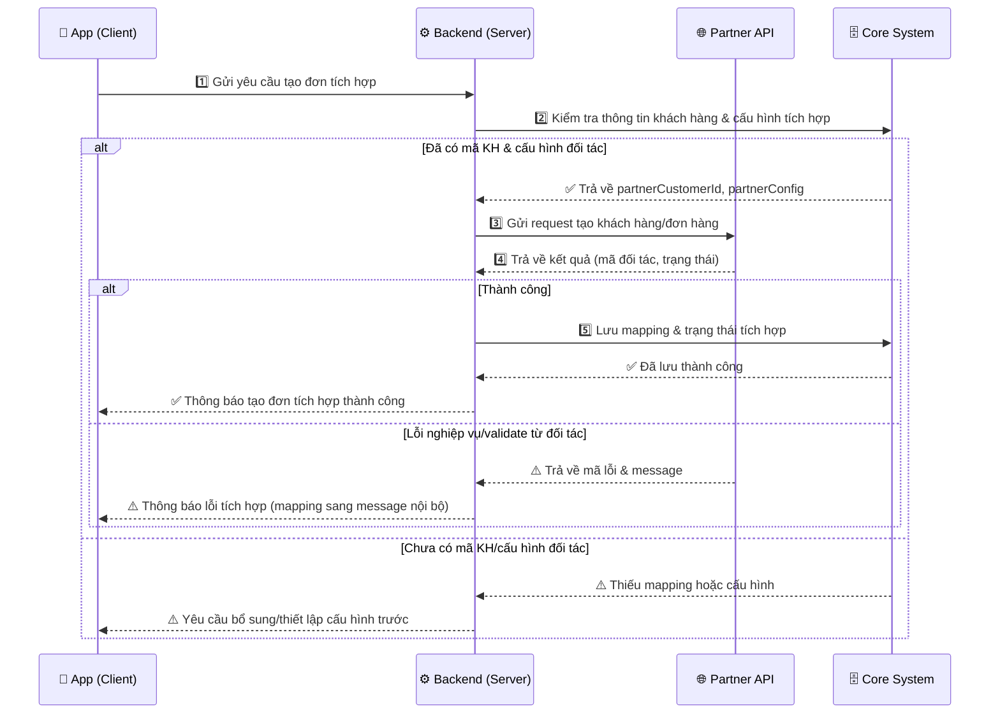
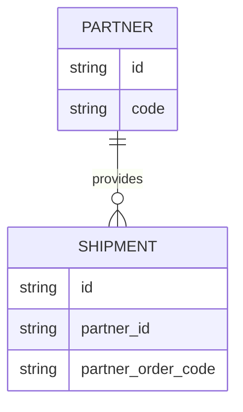

## 🎯 Mục đích Skill

Sinh **bộ tài liệu phân tích tích hợp hệ thống end-to-end** cho BA khi tích hợp với đối tác qua API, bao gồm:

- **A → H**: 
  - **A. Tổng quan & Mục đích tích hợp**
  - **B. Luồng tích hợp tổng thể (mô tả + pseudo flow)**
  - **C. Sequence diagram (Mermaid)**
  - **D. Bảng phân tích API chi tiết (request/response)**
  - **D'. Bảng mapping dữ liệu request → nguồn dữ liệu**
  - **E. Bảng mapping dữ liệu response → model nội bộ**
  - **F. Danh sách Use Case & màn hình/chức năng cần xây**
  - **G. ERD (Mermaid erDiagram)**
  - **H. Checklist cho BA để hoàn thiện & go-live**

**Đặc điểm:**

- Tập trung vào **luồng tích hợp end-to-end** giữa **Hệ thống nội bộ** và **Đối tác** (B2B, API-based).
- Đảm bảo **luồng tổng thể phải đầy đủ các bước “tiền đề”** (ví dụ: phải tạo KH ở đối tác để lấy mã KH rồi mới tạo đơn vận chuyển).
- Tự động **vẽ sequence diagram bằng Mermaid** theo format chuẩn (có happy path là chính, có nhánh lỗi nếu cần).
- **Phân tích chi tiết từng API**: Method, URL, mục đích, status code, mã lỗi.
- **Đào sâu data level**: mapping từng field request/response, nguồn dữ liệu (UI/Config/BE/Hệ thống khác), mục đích lưu trữ, khả năng tái dùng cho nhiều đối tác.
- Đề xuất **Use Case, màn hình cấu hình, process/API nội bộ** cần mở ra để các hệ thống khác tích hợp.
- Đề xuất **ERD tích hợp** (Mermaid `erDiagram`) phục vụ tracking, đối soát, đa đối tác.

---

## 📥 Đầu vào bắt buộc khi user sử dụng skill

Khi user khởi động skill (ví dụ: "phân tích luồng tích hợp", "/ba-integration-spec"), **BẮT BUỘC hỏi** các thông tin sau trước khi bắt đầu phân tích:

1. **Tên hệ thống đối tác**
   - Tên hệ thống/đối tác đang tích hợp (vd: "GHTK", "Viettel Post", "VNPay", "eKYC Partner A"…)
   - **Lưu ý:** File sẽ được lưu vào thư mục `Integration/<Tên hệ thống>/`

2. **Bối cảnh dự án & mục tiêu tích hợp**
   - Mô tả ngắn gọn domain (vd: logistics, thanh toán, eKYC…)
   - Mục tiêu tích hợp: dùng API đối tác để làm gì? (vd: tạo đơn hàng, tra cứu trạng thái, hủy đơn…)

2. **Loại tài liệu API đối tác đang có**
   - Link hoặc file:
     - OpenAPI/Swagger (JSON/YAML)
     - Postman collection
     - Tài liệu mô tả API dạng markdown/word/pdf
   - Nếu chỉ có mô tả text → vẫn phân tích, nhưng phải ghi rõ **"Giả định"**.

3. **Bối cảnh hệ thống nội bộ**
   - Hệ thống nội bộ nào gọi ra đối tác? (Core, OMS, CRM, DWH, v.v.)
   - Có tích hợp **nhiều đối tác cùng loại** không? (vd: nhiều hãng vận chuyển, nhiều cổng thanh toán) → để thiết kế model & mapping đa đối tác.

4. **Thông tin lưu trữ hiện hữu (nếu có)**
   - ERD hiện tại hoặc bảng chính liên quan (vd: `Order`, `Shipment`, `PaymentTransaction`)
   - Yêu cầu tracking/đối soát/logging của doanh nghiệp.

**Quy tắc:**

- Nếu thiếu 1 trong các đầu vào trên:
  - **Hỏi rõ lại 1 lần**.
  - Nếu user xác nhận **không có** → vẫn tiếp tục **nhưng phải ghi rõ phần "Giả định"** và **tô đậm** chỗ cần xác nhận lại.

---

## 🚀 Quy trình xử lý tổng thể của skill

Ngay khi user đã cung cấp tài liệu/bối cảnh **đủ dùng**, skill sẽ **KHÔNG hỏi thêm vòng vòng** mà **lập tức xuất bản thảo đầy đủ A→H** theo thứ tự, với các "Giả định" được đánh dấu rõ.

### Bước 1 – Phân tích bối cảnh & mục tiêu tích hợp

- Tóm tắt:
  - Hệ thống nội bộ nào → Hệ thống đối tác nào.
  - Mục tiêu nghiệp vụ chính: tạo gì, tra cứu gì, cập nhật/hủy gì.
  - Ràng buộc/ưu tiên: đồng bộ/thời gian thực, SLA, retry, idempotency (nếu có).

### Bước 2 – Xây dựng luồng tích hợp tổng thể (A, B)

- Xác định **toàn bộ hành trình E2E** từ lúc khởi tạo đến khi hoàn tất:
  - Bao gồm các **bước tiền đề bắt buộc**: ví dụ:
    - Tạo/đồng bộ Customer sang đối tác → nhận `partnerCustomerId`.
    - Thiết lập cấu hình kho/điểm lấy hàng → nhận `partnerWarehouseCode`.
    - Sau đó mới được phép tạo đơn, tra cứu, hủy…
- Sinh:
  - **Mô tả text chi tiết luồng tích hợp tổng thể** (A, B).
  - **Pseudo flow** dạng bullet/step, ví dụ:
    - B1: Hệ thống nội bộ tạo KH → Gọi API `CreateCustomer` của đối tác → Lưu `partnerCustomerId`.
    - B2: Thiết lập cấu hình kho → Gọi API `RegisterWarehouse` → Lưu `partnerWarehouseCode`.
    - B3: Khi tạo đơn mới → Dùng `partnerCustomerId` + `partnerWarehouseCode` để gọi API `CreateShipment`.

### Bước 3 – Vẽ Sequence Diagram (C)

- Sinh **sequence diagram Mermaid** theo **format tham khảo** (sẽ tùy biến theo scenario):



- **Quy tắc sequence:**
  - Có thể dùng emoji trong participant/message giống ví dụ trên.
  - Tập trung vào **luồng thành công**; nhánh lỗi chỉ ở mức chính (đối tác trả lỗi, thiếu cấu hình).
  - **Không cần liệt kê payload chi tiết** trong message; payload sẽ được mô tả ở phần D/E (bảng).

### Bước 4 – Liệt kê & phân tích danh sách API (D)

- Từ tài liệu API đối tác + luồng tổng thể + sequence:
  - Xác định **danh sách API** tham gia vào luồng tích hợp (bao gồm:
    - API tiền đề: sync customer, config, token…
    - API chính: create/update/cancel/query…)
- Sinh **bảng tổng hợp API**:

| Tên API | URL | Method | Mục đích API | Link đặc tả (nếu public) |
|---------|-----|--------|--------------|---------------------------|
| Create Customer | `/v1/customers` | POST | Tạo khách hàng tại đối tác | **Giả định:** [Link/None] |
| Create Shipment | `/v1/shipments` | POST | Tạo đơn vận chuyển | ... |
| Get Tracking | `/v1/trackings/{id}` | GET | Tra cứu trạng thái đơn | ... |

- Với **từng API**, phân tích chi tiết:
  - Thông tin cơ bản: Method, URL, Mục đích, Auth (nếu có).
  - Các **status code** & **mã lỗi** thường gặp (từ tài liệu; nếu thiếu → ghi rõ "Giả định").

### Bước 5 – Phân tích chi tiết Request/Response & Mapping (D', E)

#### 5.1. Bảng phân tích API chi tiết

Cho **mỗi API**, sinh **bảng tổng hợp lớn** gồm cả request & response với các cột:

| Field | Type | Required | Source (UI/Config/BE/Hệ thống khác) | Default/Rule | Validation | Mapping nội bộ | Persist? | Purpose | Notes |
|-------|------|----------|--------------------------------------|--------------|-----------|----------------|---------|---------|-------|

**Quy tắc:**

- **Request**:
  - Với **mỗi field request**, phải chỉ rõ:
    - **Source**:
      - UI nhập trực tiếp?
      - Lấy từ **DB cấu hình** (mã dịch vụ, kho, product mapping…)?
      - BE tự sinh (transactionId, timestamp, signature…)?
      - Lấy từ **hệ thống nội bộ khác** (vd: từ CRM, ERP)?
    - **Default/Rule**: luật gán mặc định, mapping enum, rule bắt buộc.
    - **Validation**: length, format, enum, business rule quan trọng.
- **Response**:
  - Với **mỗi field response**, phải xác định:
    - **Mapping nội bộ**: map về bảng/trường nội bộ nào (vd: `partnerOrderId` → `Shipment.partner_order_id`).
    - **Persist?**: Có lưu DB không (Yes/No).
    - **Purpose**: Lưu để làm gì:
      - Truy vết
      - Đối soát
      - Hiển thị cho user
      - Phục vụ call API các lần sau
      - Tích hợp với nhiều đối tác.
    - **Notes**: Lưu ý đa đối tác (vd: cùng ý nghĩa nhưng nhiều đối tác dùng field/format khác nhau → cần normalization).

#### 5.2. Bảng mapping dữ liệu request (D')

- Tóm lược lại theo **góc nhìn hệ thống nội bộ**:
  - Field nào cần **màn hình cấu hình**?
  - Field nào đến từ **bảng master nội bộ**?
  - Field nào **hard-code/const theo từng đối tác**?

Ví dụ:

| Field (Request) | Required | Source | Default/Rule | Validation | Notes |
|-----------------|----------|--------|--------------|-----------|-------|
| customerCode | Yes | Hệ thống nội bộ (Customer table) | Lấy theo mã KH nội bộ, map sang mã đối tác nếu có | Not empty | **Giả định:** đã có bảng mapping KH |
| warehouseCode | Yes | DB cấu hình tích hợp | Lấy theo cấu hình per-warehouse per-partner | In allowed list | Cần màn hình cấu hình kho–đối tác |

#### 5.3. Bảng mapping dữ liệu response (E)

- Tập trung vào **data cần lưu lại** và mục đích:

| Field (Response) | Mapping nội bộ | Persist? | Purpose | Notes |
|------------------|----------------|----------|---------|-------|
| partnerOrderId | Shipment.partner_order_id | Yes | Dùng tra cứu/truy vết với đối tác | Bắt buộc lưu |
| status | Shipment.partner_status_raw | Yes | Lưu status gốc để đối soát | Cần bảng mapping status đối tác → status chuẩn |

---

## 📌 Bước 6 – Danh sách Use Case & màn hình/chức năng cần xây (F)

Từ phân tích request/response & mapping, **liệt kê danh sách Use Case/chức năng** dưới dạng bảng:

| Tên chức năng | Loại chức năng (Gọi API / Tạo dữ liệu đầu vào / Cấu hình / Process nội bộ) | API liên quan | Dữ liệu trong API liên quan |
|---------------|-----------------------------------------------------------------------------|---------------|-----------------------------|
| Cấu hình kho – đối tác | Tạo dữ liệu đầu vào cho API | CreateShipment, GetFee | warehouseCode, serviceCode, partnerWarehouseCode |
| Đồng bộ khách hàng sang đối tác | Gọi API | CreateCustomer | customerName, phone, address, customerType |
| Tạo đơn vận chuyển tích hợp | Gọi API | CreateShipment | orderId, customerCode, warehouseCode, COD, weight |

- Phân loại rõ:
  - **Chức năng gọi API** trực tiếp (thường ở BE/process).
  - **Chức năng tạo/cấu hình dữ liệu đầu vào** (màn hình quản trị, cấu hình).
  - **Chức năng dạng tiến trình/API mở ra** để hệ thống khác gọi vào (API nội bộ để orchestrate).

---

## 🧩 Bước 7 – Đề xuất ERD tích hợp (G)

- Dựa trên:
  - Các field persist từ response.
  - Nhu cầu tracking, đối soát, đa đối tác.

- **Nếu user CÓ cung cấp ERD hiện tại của hệ thống:**
  - Đọc/hiểu ERD hiện tại (theo link/file user đưa).
  - Xác định:
    - **Bảng đã tồn tại** trong ERD hiện tại:
      - Chỉ liệt kê **các trường (field) cần bổ sung thêm** để phục vụ tích hợp (không vẽ lại toàn bộ bảng).
    - **Bảng CHƯA có** trong ERD hiện tại:
      - Đề xuất **đầy đủ bảng mới + các thuộc tính chính** cần có cho tích hợp.
  - Trình bày cho user dưới dạng:
    - Danh sách **bảng mới đề xuất** (tên bảng + thuộc tính).
    - Danh sách **field mới đề xuất** trên các bảng hiện có.
  - **BẮT BUỘC hỏi confirm user**:
    - Hỏi user xem:
      - Các bảng mới/field mới có phù hợp không.
      - Có cần đổi tên bảng/field để align với naming convention hiện tại không.
    - Sau khi user confirm, gợi ý:
      > "Bạn có thể cập nhật ERD dự án theo danh sách bổ sung trên. Nếu muốn, hãy gửi lại link ERD đã cập nhật để tôi dùng trong các phân tích tiếp theo."

- **Nếu user KHÔNG có ERD hiện tại:**
  - Đề xuất **ERD tích hợp từ đầu** bằng Mermaid `erDiagram` (như ví dụ dưới), và **đánh dấu rõ "Giả định"**.

- Sinh ERD bằng Mermaid `erDiagram`, ví dụ gọn:



- **Luôn suy nghĩ** theo hướng:
  - Hỗ trợ **nhiều đối tác cùng loại**.
  - Giữ được **raw data** từ đối tác để đối soát.
  - Có bảng/field **mapping chuẩn hoá** (status, service, product…).

---

## 💾 Bước 8 – Lưu file & Xuất tài liệu

### 8.1. Lưu file Markdown

- **Thư mục lưu:** `Integration/<Tên hệ thống>/`
- **Tên file:** `Integration_<Tên hệ thống>_YYYYMMDD.md`
- **Tự động tạo thư mục** nếu chưa tồn tại.
- **Lưu ngay sau khi sinh xong A→H** (không đợi user confirm).

### 8.2. Xuất file Word (.docx) - Tùy chọn

Sau khi lưu file markdown, **chủ động hỏi user**:

> "Bạn có muốn xuất file Word (.docx) từ tài liệu tích hợp này không?"

Nếu user đồng ý, chạy script:
```bash
python .claude/skills/ba-integration-spec/scripts/export_integration_spec_to_docx.py <integration_spec_file>
```

Script sẽ:
- Parse file markdown tích hợp (A→H).
- Tạo file Word với format chuẩn cho BA.
- Hỗ trợ bảng, sequence diagram (Mermaid code), ERD (Mermaid code), các section A→H.

### 8.3. Đẩy tài liệu lên Confluence - Tùy chọn

Sau khi xuất Word (hoặc nếu user yêu cầu), **chủ động hỏi user**:

> "Bạn có muốn đẩy tài liệu tích hợp này lên Confluence không? Tôi sẽ tạo một page mới với nội dung đầy đủ A→H."

Nếu user đồng ý:
- **Đã có `confluence.config.json`:** chạy luôn `push_to_confluence.py <file>`.
- **Chưa có:** hướng dẫn user làm theo **[Cấu hình Confluence](#-cấu-hình-confluence)** bên dưới, sau đó chạy script.

Chạy script:
```bash
python .claude/skills/ba-integration-spec/scripts/push_to_confluence.py <integration_spec_file>
```
*(Script đọc `confluence.config.json` trong thư mục skill; dùng `--config <path>` nếu đặt file khác.)*

Script sẽ:
- Đọc file markdown tích hợp.
- Convert markdown sang Confluence Storage Format.
- Tạo page mới trên Confluence với **Title:** `Tích hợp API - <Tên hệ thống> - <YYYY-MM-DD>`, **Nội dung** A→H, **Labels:** `integration`, `api-spec`, `<tên-hệ-thống>`.
- In ra link page vừa tạo.

---

## 🎨 Bước 9 – Tạo Mockup/High-fidelity (MH) - Tùy chọn

Sau khi hoàn thành Bước 8 (lưu file, xuất Word, đẩy Confluence), **chủ động hỏi user**:

> "Bạn có muốn tôi tạo Mockup/High-fidelity (MH) cho các màn hình/chức năng tích hợp không? Tôi có thể tạo MH cho các chức năng như: cấu hình tích hợp, mapping Customer/Item, màn hình tracking Invoice, v.v. Bạn muốn tạo MH cho màn hình nào?"

**Khi user chọn màn hình cần tạo MH:**

1. **Xác định màn hình user muốn:**
   - Dựa trên danh sách Use Case & màn hình ở phần F
   - Ví dụ: "Cấu hình tích hợp QBO", "Mapping Customer", "Mapping Item", "Màn hình xem danh sách Invoice", v.v.

2. **Sử dụng skill `mh-design` để tạo MH:**
   - Skill sẽ tự động kiểm tra brand guideline
   - Nếu chưa có brand guideline → tạo mới
   - Thiết kế MH dựa trên:
     - Bảng mapping request (field, validation, format)
     - Bảng mapping response (field hiển thị)
     - Use Case đã phân tích
     - ERD đã đề xuất

3. **Output MH:**
   - Prompt để gen MH (nếu dùng Figma Make, v.v.)
   - Hoặc code HTML demo (nếu user yêu cầu)
   - Lưu trong thư mục `Integration/<Tên hệ thống>/` hoặc `Prototype/`

**Lưu ý:**
- Có thể tạo nhiều MH cho nhiều màn hình khác nhau
- MH sẽ tuân thủ brand guideline (nếu có)
- MH sẽ thể hiện đầy đủ field, validation, format từ bảng mapping đã phân tích

---

## 🔐 Cấu hình Confluence

Để đẩy tài liệu lên Confluence, cấu hình qua **file config**. Xem hướng dẫn chi tiết: **[README_CONFLUENCE.md](README_CONFLUENCE.md)**

**Tóm tắt:**
1. Copy `confluence.config.example.json` → `confluence.config.json` (cùng thư mục với `SKILL.md`).
2. Sửa các giá trị:

```json
{
  "confluence": {
    "url": "https://your-company.atlassian.net/wiki",
    "space_key": "PROJ",
    "username": "your-email@company.com",
    "api_token": "your-confluence-api-token",
    "parent_id": ""
  }
}
```

- **url:** Confluence Cloud dùng `...atlassian.net/wiki`; Server/DC có thể chỉ `.../confluence` tùy cài đặt.
- **parent_id:** Để trống nếu tạo page gốc; điền ID page cha nếu tạo page con.

File `confluence.config.json` **đã được thêm vào .gitignore** (không commit). Dùng `--config <path>` nếu đặt config ở đường dẫn khác.

---

## 📦 Format output mặc định (A → H)

Khi user đã gửi tài liệu/bối cảnh, **mặc định luôn trả về A→H theo đúng thứ tự**, **KHÔNG hứa hẹn "làm sau"**, version hiện tại phải **dùng được ngay**, dù có nhiều "Giả định".

Cấu trúc:

- **A. Tổng quan & Mục đích tích hợp**
- **B. Luồng tích hợp tổng thể (mô tả + pseudo flow)**
- **C. Sequence diagram (Mermaid code)**
- **D. Bảng phân tích API chi tiết (request/response + error/status)**
- **D'. Bảng mapping dữ liệu request**
- **E. Bảng mapping dữ liệu response → model nội bộ**
- **F. Danh sách Use Case & màn hình/chức năng cần xây**
- **G. ERD (Mermaid erDiagram)**
- **H. Checklist cho BA để hoàn thiện & go-live**

---

## ✅ Quy tắc BẮT BUỘC

1. **Hỏi tên hệ thống đối tác ngay từ đầu** và lưu file vào `Integration/<Tên hệ thống>/`.
2. **Luôn sinh đủ A→H** trong 1 lần trả lời (mức draft), dù thiếu dữ liệu:
   - Phần thiếu phải được đánh dấu **"Giả định"** và **tô đậm** để user confirm.
3. **Lưu file ngay sau khi sinh xong A→H** (không đợi user confirm).
4. **Sequence diagram**:
   - Dùng code block ` ```mermaid `.
   - Tập trung luồng thành công; nhánh lỗi ở mức khối (alt/else).
5. **Bảng lớn cho field**:
   - Phải có đủ cột:
     - `Field`, `Type`, `Required`, `Source(UI/Config/BE)`, `Default/Rule`, `Validation`, `Mapping nội bộ`, `Persist?`, `Purpose`, `Notes`.
6. **Tư duy đa đối tác**:
   - Khi phân tích mapping response, luôn cân nhắc trường hợp có **nhiều đối tác cùng loại**.
7. **Không hứa "sẽ làm sau"**:
   - Phiên bản trả ra **luôn usable**, dù là bản nháp có giả định.
8. **Sau khi lưu file, chủ động hỏi user** về xuất Word và đẩy Confluence (Bước 8).
9. **Sau khi hoàn thành Bước 8, chủ động hỏi user** về tạo MH (Mockup/High-fidelity) cho các màn hình tích hợp (Bước 9).

---

## ❌ Không được

1. Bỏ qua hỏi **tên hệ thống đối tác** hoặc lưu file sai thư mục (phải lưu vào `Integration/<Tên hệ thống>/`).
2. Chỉ trả sequence mà **không** có phần B, D, D', E, F, G, H.
3. Không đánh dấu "Giả định" khi tự suy luận quan trọng (field, API bắt buộc, flow tiền đề).
4. Bỏ qua phân tích **nguồn dữ liệu request** (UI/Config/BE/Hệ thống khác).
5. Bỏ qua **mapping response → model nội bộ** và "Persist? / Purpose".
6. Chỉ liệt kê API mà không chỉ rõ **Use Case + chức năng cấu hình** cần có.
7. Đợi user confirm mới lưu file (phải lưu ngay sau khi sinh xong A→H).
8. Bỏ qua hỏi user về tạo MH sau khi hoàn thành tài liệu tích hợp (phải hỏi ở Bước 9).

---

## 🔧 Scripts

### Export to Word
```bash
python .claude/skills/ba-integration-spec/scripts/export_integration_spec_to_docx.py <integration_spec_file> [output_file]
```

### Push to Confluence
```bash
python .claude/skills/ba-integration-spec/scripts/push_to_confluence.py <integration_spec_file>
```
Đọc config từ `confluence.config.json`; dùng `--config <path>` nếu đặt file khác. Xem **[Cấu hình Confluence](#-cấu-hình-confluence)**.

---

**Version:** 1.0.0 | **Ngày:** 2026-01-20

