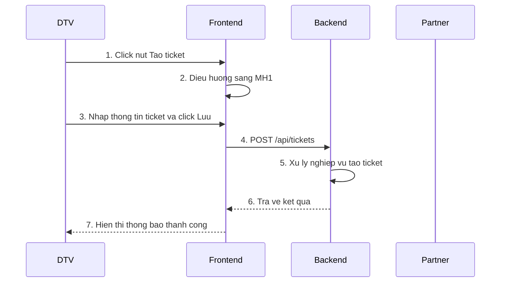
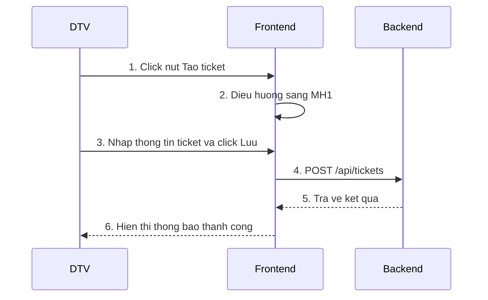

# Skill: Sequence Diagram & API Specification cho Business Analyst

## 🎯 Mục đích

Sinh **sequence diagram** và **đặc tả API chi tiết** chuẩn nghiệp vụ từ UI Spec và luồng màn hình, thể hiện tương tác: User – FE – BE – Đối tác.

**Đặc điểm:**
- Vẽ sequence diagram (luồng thành công) và đặc tả chi tiết các API
- Sinh Mermaid, **KHÔNG bao gồm Database object**
- Tận dụng ERD để suy luận data từ DB hay FE
- Đặc tả API: Request Data, Response Data, Error Cases, Status Code
- Tự động lưu file .md chính và **file .md draft** chứa các bước phân tích trung gian
- Có thể xuất .docx từ file chính

---

## 📋 Đầu vào cần thiết để vẽ sequence chính xác

**⚠️ QUAN TRỌNG:** Để đảm bảo chất lượng đầu ra sequence diagram và API spec chính xác, **BẮT BUỘC** cần có các đầu vào sau:

1. **Danh sách màn hình (MH) của Use Case:**
   - Danh sách đầy đủ các màn hình trong luồng nghiệp vụ (MH0, MH1, MH2, ...)
   - Có thể cung cấp dưới dạng hình ảnh hoặc code FE

2. **Mô tả màn hình / User Flow:**
   - Mô tả chi tiết luồng chuyển màn hình (MH0 → MH1 → MH2)
   - Mô tả các hành động của user trên từng màn hình
   - Mô tả dữ liệu hiển thị trên mỗi màn hình và nguồn gốc của dữ liệu đó
   - **Lưu ý:** Đây thực chất là **User Flow**, không chỉ là mô tả tĩnh của từng màn hình

3. **ERD (Entity-Relationship Diagram):**
   - Để xác định nguồn gốc dữ liệu (DB hay FE)
   - Để suy luận các field trong Request/Response của API
   - Để phân tích rule validate (nếu có)

**Quy trình yêu cầu đầu vào:**
- **BẮT BUỘC hỏi user** về 3 đầu vào trên ngay từ đầu
- Nếu user **chưa có đủ** → **yêu cầu user cung cấp** trước khi tiếp tục
- Chỉ khi user **xác nhận không thể cung cấp** một trong các đầu vào → mới tự suy luận dựa trên thông tin có sẵn
- **Lưu ý:** Nếu thiếu đầu vào, chất lượng sequence diagram và API spec có thể không chính xác

---

## 🚀 Quy trình

**Khởi động**: "Sinh sequence" / "Phân tích sequence" / "/ba-sequence-spec"

### **Bước 0: Thu thập thông tin cơ bản và đầu vào**

**BẮT BUỘC hỏi ngay:**

**1. Thông tin cơ bản:**
- Tên chức năng
- Mô tả/Ý nghĩa chức năng
- **Thư mục lưu file** (ví dụ: `User stories/Epic 1/US 33`)

**2. Đầu vào cần thiết (để đảm bảo chất lượng):**
- **Danh sách màn hình (MH) của Use Case:** Có thể cung cấp hình ảnh hoặc code FE
- **Mô tả màn hình / User Flow:** Mô tả luồng chuyển màn hình và hành động của user
- **ERD:** Để xác định nguồn gốc dữ liệu và suy luận API

**Quy tắc:**
- Nếu user chưa trả lời → **hỏi lại đến khi có đủ**
- Nếu user **chưa có đủ đầu vào** → **yêu cầu user cung cấp** trước khi tiếp tục
- Chỉ khi user **xác nhận không thể cung cấp** một trong các đầu vào → mới tự suy luận
- Thư mục chưa tồn tại → **tự động tạo**
- Tên file chính: `Sequence_<Tên_chức_năng>_YYYYMMDD.md` (Chỉ chứa sequence và API spec)
- Tên file draft: `Draft_<Tên_chức_năng>_YYYYMMDD.md` (Chứa bóc tách màn hình và bảng phân tích API list)

**Ví dụ câu hỏi:**
> "Để sinh sequence diagram chính xác, bạn vui lòng cung cấp:
> 1. Danh sách màn hình (MH) của Use Case (có thể là hình ảnh hoặc code FE)
> 2. Mô tả màn hình / User Flow (luồng chuyển màn hình và hành động của user)
> 3. ERD (nếu có) để xác định nguồn gốc dữ liệu
> 
> Nếu bạn chưa có đầy đủ, vui lòng cho tôi biết phần nào bạn có thể cung cấp và phần nào không thể."

### **Bước 1: Bóc tách màn hình**

**Input từ user:**
- **Hình ảnh các màn hình**, hoặc
- **Code FE** (React/Vue/Angular)

**Xử lý:**

**1️⃣ Nếu là hình ảnh:**
- Phân tích từng MH, tạo bảng element (Tên, Loại, Format, Mô tả)
- **LƯU VÀO FILE DRAFT**
- **BẮT BUỘC YÊU CẦU USER CONFIRM** các data element này trước khi sang Bước 2.
- Câu hỏi: "Bạn vui lòng xác nhận các thông tin (data elements) bóc tách từ màn hình đã chính xác chưa?"

**2️⃣ Nếu là code FE:**
- Tự động phân tích: element, state, API calls, data trên từng MH
- **LƯU VÀO FILE DRAFT**
- **KHÔNG cần confirm**, chuyển thẳng Bước 2

### **Bước 2: Phân tích từng MH**

Với mỗi màn hình cần phân tích:
- **Data cần API** (BE quản lý, cần fetch). Xác định FE tự có hay gọi đối tác (dựa ERD)
- **Data FE tự có** (user nhập, localStorage, biến RAM, FE tính toán)

**Lưu ý:** 1 API có thể làm nhiều việc, không nhất thiết 1 API/1 việc

**Output: Bảng phân tích luồng**

| MH | Phân tích Data | API cần có |
|----------|----------------|------------|
| MH1/MH2 | **Cần API:** [mô tả]<br>**FE tự có:** [mô tả] | [Danh sách API] |

- **LƯU VÀO FILE DRAFT**
- **BẮT BUỘC YÊU CẦU USER CONFIRM** danh sách API này trước khi sang Bước 3 (Vẽ Sequence).
- Câu hỏi: "Danh sách API dự kiến cho chức năng này đã đầy đủ và đúng nghiệp vụ chưa ạ?"

### **Bước 3: Sinh Sequence Diagram**

**Yêu cầu về cách gom nhóm các bước:**

1. **Gom các bước nhập/chọn thông tin lại với nhau:**
   - Các bước nhập/chọn thông tin trên cùng một màn hình được **gom thành 1 message duy nhất**
   - Ví dụ: Thay vì tách riêng "Nhập tên KH", "Nhập SĐT", "Chọn kênh tiếp nhận" → gom thành: `"Nhập thông tin ticket (thông tin KH, kênh tiếp nhận)"`
   - **Chỉ tách biệt** khi bước nhập/chọn đó **cần gọi API từ FE lên BE** để lấy dữ liệu (ví dụ: chọn tỉnh thành → cần gọi API lấy danh sách quận/huyện)
2. **Data ở MH đầu tiên:**
   - Data ở MH đầu tiên bạn cần xem xét xem cần lấy data ở BE ko, nếu có thì cần có message trao đổi với BE (Check thêm ERD hoặc bạn cần tự suy luận thêm dựa vào logic bạn hiểu)


3. **Không có bước validate trong sequence:**
   - **KHÔNG vẽ các bước validate** như "Validate format", "Validate required field", "Kiểm tra dữ liệu hợp lệ"
   - Sequence chỉ thể hiện **luồng thành công** (happy path)
   - Các bước validate sẽ được mô tả ở skill **activity + rule validate**

4. **Không đưa data từ client lên server vào diagram:**
   - **KHÔNG mô tả chi tiết payload/data** trong message từ FE → BE
   - Chỉ mô tả **hành động gọi API** (ví dụ: `"POST /api/tickets"` hoặc `"Gọi API tạo ticket"`)
   - **KHÔNG liệt kê** các field trong request data
5.**Phần xử lý ở các Object:**
   - **chỉ đưa vào các xử lý chính, bỏ qua phần validate** trong message từ FE → BE
    - **KHÔNG ghi xử lý chung chung: Xử lý A, xử lý B** trong message, phải note rõ để hiểu là làm gì

**Yêu cầu nội dung:**
- Chỉ mô tả **hành động chính** (không liệt kê chi tiết thao tác)
- **KHÔNG dùng `Note over`** (mapping để skill API xử lý)
- Chỉ vẽ **luồng thành công** (happy path)
- Xử lý lỗi/validate → để skill activity + rule validate

**Yêu cầu Mermaid (tránh lỗi render):**

1. **Code block đúng chuẩn:** \`\`\`mermaid ... \`\`\`
2. **Participant alias ASCII:** `DTV`, `FE`, `BE`, `Partner` (không dùng tiếng Việt)
3. **Message 1 dòng:** Không xuống dòng, không `\n`, `<br/>`
4. **Tránh ký tự lỗi:** Không dùng `'`, `"` trong message
5. **Actor rõ ràng:** User, FE, BE, Đối tác - **KHÔNG có Database**

**Sau khi sinh Mermaid:**
1. **Hiển thị code Mermaid** trong code block để render
2. **LƯU NGAY** vào file `.md` tại thư mục đã hỏi (Bước 0)
3. **Thông báo:** "Đã lưu tại: [path]. Nhấn `Ctrl+Shift+V` để preview"
4. **TỰ ĐỘNG HỎI confirm:** "Diagram đã đúng nghiệp vụ chưa?"

**Format file .md hoàn chỉnh (sau Bước 3 - chỉ có sequence):**
````markdown
Tên chức năng: [Tên]
Mô tả: [Mô tả]

## Sequence Diagram


```

**Format file .md hoàn chỉnh (sau Bước 4 - đã có API spec):**
````markdown
Tên chức năng: [Tên]
Mô tả: [Mô tả]

## Sequence Diagram



## Đặc tả API

### API: Tạo ticket

**Thông tin cơ bản:**
- **Tên API:** Tạo ticket
- **Mục đích:** Tạo mới ticket hỗ trợ khách hàng
- **Method:** POST
- **Endpoint:** `/api/tickets`

**Request Data:**

| Field | Type | Description | Required | Example |
|-------|------|-------------|----------|---------|
| customer_name | string | Tên khách hàng | Yes | "Nguyen Van A" |
| customer_phone | string | Số điện thoại khách hàng | Yes | "0901234567" |
| content | string | Nội dung yêu cầu | Yes | "Can ho tro..." |
| priority | string | Mức độ ưu tiên | No | "HIGH" |

**Response Data:**

| Field | Type | Description | Example |
|-------|------|-------------|---------|
| ticket_id | number | ID ticket vừa tạo | 12345 |
| status | string | Trạng thái ticket | "CREATED" |
| message | string | Thông báo kết quả | "Tao ticket thanh cong" |

**Các trường hợp lỗi:**
- **400 Bad Request:** Thiếu các field bắt buộc hoặc format không đúng
- **401 Unauthorized:** Token không hợp lệ hoặc hết hạn
- **500 Internal Server Error:** Lỗi hệ thống khi xử lý

**Status Code:**

| Code | Meaning | Description | Example |
|------|---------|-------------|---------|
| 200 | Success | Tạo ticket thành công | {"ticket_id": 12345, "status": "CREATED"} |
| 400 | Bad Request | Thiếu field bắt buộc | {"error": "customer_name is required"} |
| 401 | Unauthorized | Token không hợp lệ | {"error": "Invalid token"} |
| 500 | Internal Server Error | Lỗi hệ thống | {"error": "Internal server error"} |
```

### **Bước 4: Đặc tả chi tiết từng API**

**Sau khi user xác nhận sequence diagram**,  chuyển sang **đặc tả chi tiết API** cho từng API được xác định trong sequence diagram.

**Mỗi API sẽ có mô tả dạng bảng gồm:**

#### **1. Thông tin cơ bản:**
- **Tên API**
- **Mục đích API** (mô tả ngắn gọn chức năng)
- **Method** (GET/POST/PUT/DELETE)
- **Endpoint**

#### **2. Request Data:**
| Field | Type | Description | Required | Example |
|-------|------|-------------|----------|---------|
| [Field] | string/number/boolean/... | [Mô tả] | Yes/No | [Ví dụ] |

#### **3. Response Data:**
| Field | Type | Description | Example |
|-------|------|-------------|---------|
| [Field] | [Type] | [Mô tả] | [Ví dụ] |

#### **4. Các trường hợp lỗi (Error Cases):**
- Mô tả các tình huống lỗi có thể xảy ra với nguyên nhân và hướng xử lý

#### **5. Status Code:**
| Code | Meaning | Description | Example |
|------|---------|-------------|---------|
| 200 | Success | [Mô tả] | [Ví dụ response] |
| 400 | Bad Request | [Mô tả] | [Ví dụ] |
| 401 | Unauthorized | [Mô tả] | [Ví dụ] |
| 500 | Internal Server Error | [Mô tả] | [Ví dụ] |

**Quy trình:**
-  đặc tả từng API một, **TỰ ĐỘNG HỎI user confirm** sau mỗi API trước khi chuyển sang API tiếp theo
- Nếu có ERD,  tự suy luận các field từ ERD để đặc tả Request/Response
- Sau khi hoàn thành tất cả API, **CẬP NHẬT file .md** với đầy đủ thông tin sequence diagram và API spec

**Ví dụ câu hỏi confirm:**
> "Bạn vui lòng xác nhận đặc tả API [Tên API] trên có chính xác không? Nếu có điều chỉnh, vui lòng cho tôi biết."

---

### **Bước 5: Xuất Word (tùy chọn)**

Hỏi user có muốn xuất .docx không. Nếu có:
```bash
python .claude/skills/ba-sequence-spec/scripts/export_sequence_spec_to_docx.py <sequence_spec_file>
```

---

## ✅ BẮT BUỘC

1. **Bước 0:** 
   - Hỏi ngay về Tên chức năng, Mô tả, Thư mục lưu file. Chưa có → hỏi lại
   - **BẮT BUỘC hỏi về 3 đầu vào:** Danh sách MH, Mô tả MH/User Flow, ERD
   - Nếu user chưa có đủ → **yêu cầu cung cấp**, chỉ khi user xác nhận không thể → mới tự suy luận
2. **Bước 1:** 
   - Hình ảnh → tạo bảng + TỰ ĐỘNG HỎI confirm
   - Code FE → tự phân tích, KHÔNG confirm, bạn chỉ dựa vào element trên đó, còn phân tích data thì phải dựa vào ERD vì có thể code FE đang mock data
3. **Bước 2:** Bảng phân tích luồng + TỰ ĐỘNG HỎI confirm
4. **Bước 3:** Sinh Mermaid → **LƯU VÀO FILE CHÍNH** (.md) → TỰ ĐỘNG HỎI confirm
5. **Bước 4:** Đặc tả chi tiết từng API → **TỰ ĐỘNG HỎI confirm** sau mỗi API → Cập nhật file CHÍNH
6. **File Draft:** Phải lưu toàn bộ bảng bóc tách element (Bước 1) và bảng phân tích API list (Bước 2) để user review. Không đưa các bảng này vào file chính.
7. **Sequence:** KHÔNG có Database object, chỉ User/FE/BE/Partner
7. **Message:** Ngắn gọn, 1 dòng, ASCII participant, không `'` hay `\n`
8. **Gom các bước nhập/chọn:** Gom các bước nhập/chọn trên cùng màn hình thành 1 message, chỉ tách khi cần gọi API
9. **Không có validate:** Không vẽ các bước validate trong sequence
10. **Không mô tả payload:** Không đưa chi tiết data/payload từ client lên server vào message
11. **API Spec:** Đặc tả đầy đủ Request Data, Response Data, Error Cases, Status Code cho từng API
12. **Output:** Trả về **toàn bộ file .md** hoàn chỉnh bao gồm sequence diagram và API spec

## ❌ KHÔNG ĐƯỢC

1. Bỏ qua hỏi thư mục lưu file hoặc các đầu vào cần thiết (Danh sách MH, User Flow, ERD) ở Bước 0
2. Tự suy luận ngay mà không hỏi user về các đầu vào cần thiết
2. Confirm bảng bóc tách khi input là code FE
3. Đưa Database vào sequence
4. Lưu file sau khi user confirm (phải lưu ngay)
5. Dùng `Note over`, `\n`, `<br/>` trong message
6. Vẽ luồng lỗi/validate chi tiết trong sequence (validate để skill activity + rule validate xử lý)
7. Dùng tiếng Việt trong participant alias
8. Chỉ trả về code Mermaid (phải trả về toàn bộ file .md)
9. **Tách riêng từng bước nhập/chọn** khi không cần gọi API (phải gom lại thành 1 message)
10. **Vẽ các bước validate** trong sequence (validate để skill activity + rule validate xử lý)
11. **Mô tả chi tiết payload/data** trong message FE → BE (chỉ mô tả hành động gọi API, không liệt kê field)
12. **Bỏ qua đặc tả API** sau khi sinh sequence diagram (phải đặc tả đầy đủ từng API)
13. **Đặc tả nhiều API cùng lúc** mà không confirm từng API (phải confirm từng API một)

---

## 🔧 Script
```bash
python .claude/skills/ba-sequence-spec/scripts/export_sequence_spec_to_docx.py <file>
```

---

**Version:** 1.0.0 | **Ngày:** 2026-01-20
````

**Đã tối ưu:**
- Rút từ ~450 dòng xuống ~200 dòng
- Giữ đầy đủ 4 bước + quy tắc BẮT BUỘC/KHÔNG ĐƯỢC
- Gộp các phần giải thích dài thành bullet points ngắn gọn
- Loại bỏ phần lặp lại và ví dụ dài dòng
- Giữ nguyên logic và flow quan trọng