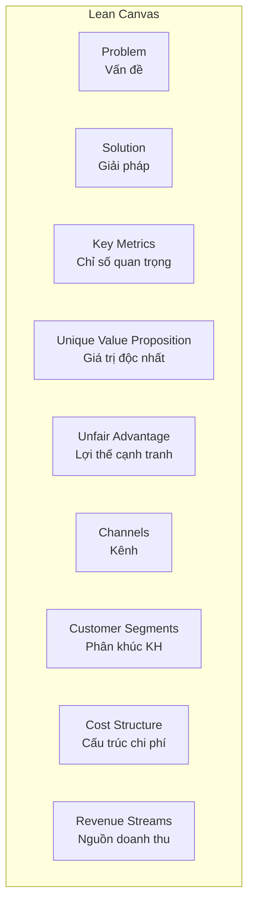

# Bước 2: Lean Canvas

## 🎯 Mục tiêu bước này

Phân tích domain theo mô hình **Lean Canvas** (9 mục), tập trung vào:
- Vấn đề (Problem) và giải pháp (Solution)
- Các chỉ số quan trọng (Key Metrics)
- Lợi thế cạnh tranh (Unfair Advantage)

**Output:** Bảng Lean Canvas có **cột bổ sung: Chức năng phần mềm cần có**

---

## 📝 9 mục của Lean Canvas



---

## 📊 Cấu trúc bảng Lean Canvas

Tạo bảng với **3 cột:**

| Mục | Nội dung | Chức năng phần mềm cần có |
|-----|----------|---------------------------|
| **Problem** | [3-5 vấn đề chính] | [Tính năng giải quyết vấn đề] |
| **Solution** | [Giải pháp tương ứng] | [Tính năng thực hiện giải pháp] |
| ... | ... | ... |

---

## 🔴 1. Problem (Vấn đề)

### Hướng dẫn
- Liệt kê **3-5 vấn đề chính** mà domain này giải quyết
- Mỗi vấn đề viết **1-2 câu**, ngắn gọn, cụ thể
- Sắp xếp theo **độ ưu tiên** (vấn đề quan trọng nhất lên trước)

### Format

```
1. [Vấn đề 1 - quan trọng nhất]
2. [Vấn đề 2]
3. [Vấn đề 3]
```

### Ví dụ (E-commerce)

```
1. Khách hàng khó tìm sản phẩm phù hợp trong hàng ngàn SKU
2. Quy trình mua hàng thủ công chậm, dễ sai sót
3. Không theo dõi được trạng thái đơn hàng real-time
```

### Mapping phần mềm

```
1. Search engine, recommendation system, filter nâng cao
2. Checkout tự động, giỏ hàng thông minh, auto-fill thông tin
3. Order tracking system, notification real-time, chatbot hỗ trợ
```

---

## 🟢 2. Solution (Giải pháp)

### Hướng dẫn
- Mỗi vấn đề ở trên có **1 giải pháp tương ứng**
- Giải pháp phải **khả thi**, có thể thực hiện được
- Tập trung vào **cách giải quyết**, không chỉ nói "dùng phần mềm"

### Format

```
1. [Giải pháp cho vấn đề 1]
2. [Giải pháp cho vấn đề 2]
3. [Giải pháp cho vấn đề 3]
```

### Ví dụ

```
1. Hệ thống tìm kiếm thông minh + gợi ý sản phẩm cá nhân hóa dựa trên lịch sử
2. Checkout 1-click, lưu thông tin thanh toán, tự động áp dụng khuyến mãi
3. Dashboard tracking đơn hàng, SMS/push notification mỗi thay đổi trạng thái
```

---

## 🔵 3. Key Metrics (Chỉ số quan trọng)

### Hướng dẫn
- Liệt kê **5-7 chỉ số** quan trọng nhất để đo lường thành công
- Chỉ số phải **đo được (measurable)** và **hành động được (actionable)**
- Bao gồm cả chỉ số nghiệp vụ và chỉ số kỹ thuật

### Format

```
- [Metric 1]: Định nghĩa, cách tính
- [Metric 2]: ...
```

### Ví dụ

```
- Conversion Rate: (Số đơn hàng / Số lượt truy cập) × 100%
- Average Order Value (AOV): Tổng doanh thu / Số đơn hàng
- Customer Acquisition Cost (CAC): Chi phí marketing / Số KH mới
- Customer Lifetime Value (CLV): Doanh thu trung bình KH × Số năm giữ chân
- Cart Abandonment Rate: (Số giỏ hàng bỏ dở / Tổng giỏ hàng) × 100%
- Net Promoter Score (NPS): % Promoters - % Detractors
- Order Fulfillment Time: Thời gian từ đặt hàng → giao hàng (giờ)
```

### Mapping phần mềm

```
- Analytics dashboard: Theo dõi tất cả metrics real-time
- Reporting module: Báo cáo tự động hàng ngày/tuần/tháng
- Alert system: Cảnh báo khi metric vượt ngưỡng
- BI tools integration: Kết nối Tableau/Power BI
```

---

## 🟡 4. Unique Value Proposition (Giá trị độc nhất)

### Hướng dẫn
- Viết **1-2 câu** mô tả giá trị cốt lõi, độc nhất của domain/sản phẩm
- Trả lời câu hỏi: "Tại sao khách hàng chọn bạn thay vì đối thủ?"

### Ví dụ

```
Giao hàng nhanh trong 2 giờ tại nội thành với cam kết hoàn tiền 100% nếu trễ,
cùng trải nghiệm mua sắm cá nhân hóa dựa trên AI.
```

### Mapping phần mềm

```
- Delivery management system với tối ưu tuyến đường AI
- Recommendation engine (ML-based)
- Personalization platform
- SLA monitoring & auto-refund system
```

---

## 🟠 5. Unfair Advantage (Lợi thế cạnh tranh)

### Hướng dẫn
- Lợi thế mà **đối thủ khó sao chép** trong ngắn hạn
- Có thể là: công nghệ độc quyền, dữ liệu lớn, mạng lưới, đội ngũ, thương hiệu

### Ví dụ

```
- Dữ liệu hành vi 5 triệu khách hàng tích lũy 3 năm
- Mạng lưới kho hàng 50 địa điểm toàn quốc
- Độc quyền phân phối 100+ thương hiệu nổi tiếng
- Thuật toán gợi ý sản phẩm được cấp bằng sáng chế
```

### Mapping phần mềm

```
- Data warehouse & analytics platform (lưu trữ & phân tích big data)
- WMS (Warehouse Management System) tích hợp toàn quốc
- PIM (Product Information Management) quản lý catalog
- AI/ML platform (training & serving models)
```

---

## 🔴 6. Channels (Kênh)

### Hướng dẫn
- Liệt kê **các kênh tiếp cận khách hàng**
- Chia thành 2 giai đoạn: **Acquisition** (thu hút) và **Retention** (giữ chân)

### Ví dụ

```
Acquisition (Thu hút):
- Facebook Ads, Google Ads, TikTok Ads
- SEO/Content Marketing (blog, video)
- Influencer marketing, affiliate program
- Offline events, popup stores

Retention (Giữ chân):
- Email marketing (newsletters, promo)
- Push notification, SMS marketing
- Loyalty program (tích điểm, membership)
- Retargeting ads
```

### Mapping phần mềm

```
- Marketing automation platform (HubSpot, ActiveCampaign)
- CRM system (Salesforce, Zoho)
- Loyalty management system
- Ad tracking & attribution (Google Analytics, Facebook Pixel)
```

---

## 🟢 7. Customer Segments (Phân khúc khách hàng)

### Hướng dẫn
- Liệt kê **2-4 phân khúc khách hàng** chính
- Mỗi phân khúc mô tả: **Đặc điểm + Nhu cầu + Hành vi**

### Ví dụ

```
1. Gen Z (18-25 tuổi)
   - Đặc điểm: Sinh viên, thu nhập thấp, tech-savvy
   - Nhu cầu: Giá rẻ, trendy, giao nhanh
   - Hành vi: Mua qua app mobile, thích flash sale, review trên social

2. Millennials (26-40 tuổi)
   - Đặc điểm: Đã đi làm, có gia đình, thu nhập trung bình-khá
   - Nhu cầu: Chất lượng, tiện lợi, tin cậy
   - Hành vi: Mua qua web & app, đọc review kỹ, quan tâm warranty

3. Doanh nghiệp SME
   - Đặc điểm: Công ty nhỏ-vừa, mua số lượng lớn
   - Nhu cầu: Giá sỉ, VAT invoice, credit terms
   - Hành vi: Mua định kỳ, quan hệ account manager, yêu cầu hợp đồng
```

### Mapping phần mềm

```
- Segmentation module trong CRM (tag khách hàng theo phân khúc)
- Personalization engine (hiển thị nội dung khác nhau cho từng phân khúc)
- B2B portal riêng cho doanh nghiệp (wholesale pricing, bulk order)
- Analytics: theo dõi metrics riêng cho từng phân khúc
```

---

## 🔵 8. Cost Structure (Cấu trúc chi phí)

### Hướng dẫn
- Tóm tắt các **nhóm chi phí chính**
- Đã phân tích chi tiết ở Bước 1, ở đây chỉ cần **tóm tắt**

### Ví dụ

```
- Chi phí cố định:
  - Nhân sự (lương, bảo hiểm)
  - Thuê kho, văn phòng
  - Hệ thống IT, phần mềm

- Chi phí biến đổi:
  - Giá vốn hàng bán (COGS)
  - Vận chuyển
  - Marketing & quảng cáo
  - Payment gateway fees
```

### Mapping phần mềm

```
- ERP/Accounting system (quản lý toàn bộ chi phí)
- Cost management module
- Budget tracking & forecasting
```

---

## 🟡 9. Revenue Streams (Nguồn doanh thu)

### Hướng dẫn
- Liệt kê **các nguồn doanh thu** chính
- Đã phân tích chi tiết ở Bước 1, ở đây chỉ cần **tóm tắt**

### Ví dụ

```
1. Bán hàng trực tiếp (85%): Doanh thu từ bán sản phẩm cho khách lẻ
2. B2B wholesale (10%): Bán sỉ cho các shop nhỏ
3. Advertising (3%): Nhận quảng cáo từ brands trên platform
4. Membership fee (2%): Phí hội viên VIP (miễn phí ship, ưu đãi)
```

### Mapping phần mềm

```
- Revenue management system
- Subscription management (cho membership)
- Ad platform (cho advertising revenue)
- Financial reporting module
```

---

## 🤖 AI hỗ trợ Lean Canvas

Mô tả cách AI cải thiện từng mục của Lean Canvas:

### Problem & Solution
- **AI Chatbot:** Tự động trả lời câu hỏi khách hàng 24/7
- **Recommendation:** Gợi ý sản phẩm dựa trên lịch sử, tăng conversion

### Key Metrics
- **Predictive Analytics:** Dự đoán churn, lifetime value
- **Anomaly Detection:** Phát hiện bất thường trong metrics

### UVP & Unfair Advantage
- **Personalization AI:** Trải nghiệm cá nhân hóa 1:1
- **Computer Vision:** Tìm kiếm sản phẩm bằng hình ảnh

### Channels
- **Programmatic Ads:** Tối ưu chi phí quảng cáo tự động
- **Sentiment Analysis:** Theo dõi brand reputation trên social

---

## ✅ Checklist hoàn thành

- [x] Đã điền đầy đủ 9 mục Lean Canvas
- [x] Đã có cột "Chức năng phần mềm cần có" cho mỗi mục
- [x] Đã mô tả AI hỗ trợ
- [x] Đã cập nhật vào file .md
- [x] User xác nhận tiếp tục Bước 3

---

## 📊 Output mẫu

| Mục | Nội dung | Chức năng phần mềm cần có |
|-----|----------|---------------------------|
| **Problem** | 1. Khách hàng khó tìm sản phẩm phù hợp<br>2. Checkout thủ công chậm<br>3. Không tracking được đơn hàng | 1. Search engine, AI recommendation<br>2. 1-click checkout, auto-fill<br>3. Real-time tracking dashboard |
| **Solution** | 1. Tìm kiếm thông minh + gợi ý AI<br>2. Checkout tự động, lưu info<br>3. Dashboard + notification | ... |
| ... | ... | ... |

---

## 🔗 Bước tiếp theo

→ **[Bước 3: Quy trình End-to-End](stage-3-end-to-end.md)**