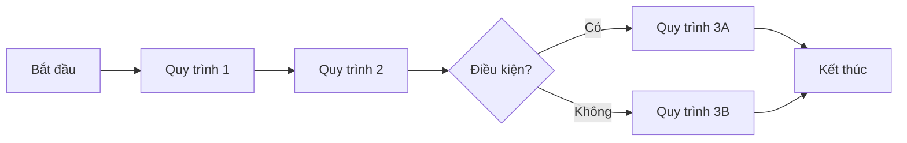
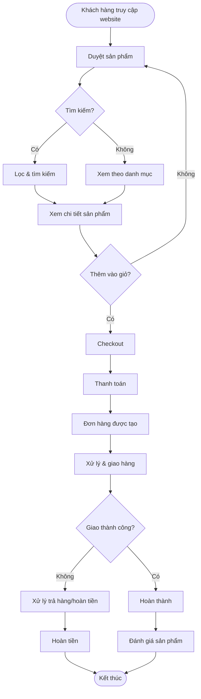

# Bước 3: Quy trình End-to-End

## 🎯 Mục tiêu bước này

- Mô tả **luồng nghiệp vụ tổng quan** của domain
- Xác định **các quy trình cốt lõi**
- Liệt kê **thực thể quản lý** và thuộc tính cơ bản
- Mapping **chức năng phần mềm** cần có cho từng quy trình

---

## 📝 Các công việc cần làm

### 1. Vẽ sơ đồ quy trình tổng quan

Sử dụng **mermaid diagram** để vẽ luồng nghiệp vụ từ đầu đến cuối.

#### Template

#### Lưu ý:
- **Quy trình** là các hoạt động chính, không phải bước chi tiết
- Hiển thị **điểm quyết định** (decision points) nếu có
- Thể hiện **luồng chính** và **luồng phụ** (nếu cần)

---

### 2. Liệt kê quy trình cốt lõi

Với MỖI quy trình trong sơ đồ, mô tả:

#### Quy trình X: [Tên quy trình]

**Mô tả:**
_1-2 câu mô tả ngắn gọn về quy trình này làm gì_

**Chi tiết các bước:**

| Bước | Ai | Làm gì | Input | Output | Ứng dụng | Quy định/Validate cần lưu ý |
|------|----|--------|-------|--------|----------|----------------------------|
| 1. [Tên bước] | [Người/vai trò thực hiện] | [Mô tả hành động] | [Input chung chung, không chi tiết trường] | [Output chung chung] | [Tên ứng dụng/module] | • Validate/Quy định 1 • Validate/Quy định 2 |
| 2. [Tên bước] | ... | ... | ... | ... | ... | ... |

**Lưu ý:**
- **Input/Output:** Chỉ mô tả chung chung (ví dụ: "Thông tin đơn hàng", "Mã vận đơn"), KHÔNG liệt kê chi tiết từng trường dữ liệu
- **Quy định/Validate:** Liệt kê các quy tắc nghiệp vụ, validation rules, điều kiện cần kiểm tra
- **Ai:** Có thể là người (vai trò) hoặc hệ thống

---

### 3. Xác định mối quan hệ giữa các quy trình

Mô tả **sự phụ thuộc** giữa các quy trình:
- Quy trình A phải hoàn thành trước khi B bắt đầu
- Quy trình C và D có thể chạy song song
- Quy trình E trigger quy trình F

---

## 📊 Ví dụ mẫu (E-commerce)

### 1. Sơ đồ quy trình tổng quan

---

### 2. Quy trình cốt lõi

#### Quy trình 1: Duyệt & Tìm kiếm sản phẩm

**Mô tả:**
Khách hàng duyệt catalog, tìm kiếm, lọc sản phẩm theo nhu cầu.

**Chi tiết các bước:**

| Bước | Ai | Làm gì | Input | Output | Ứng dụng | Quy định/Validate cần lưu ý |
|------|----|--------|-------|--------|----------|----------------------------|
| 1. Duyệt catalog | Khách hàng | Xem danh sách sản phẩm theo danh mục | Category ID, filter criteria | Danh sách sản phẩm | E-commerce Website | • Validate category tồn tại • Pagination: tối đa 50 sản phẩm/trang |
| 2. Tìm kiếm | Khách hàng | Nhập từ khóa tìm kiếm | Search query | Kết quả tìm kiếm | Search Engine | • Validate query không rỗng • Xử lý typo, từ đồng nghĩa |
| 3. Lọc sản phẩm | Khách hàng | Áp dụng filter (giá, brand, rating) | Filter criteria | Danh sách sản phẩm đã lọc | Filter Module | • Validate filter values hợp lệ • Kết hợp nhiều filter |
| 4. Xem chi tiết | Khách hàng | Click vào sản phẩm để xem chi tiết | Product ID | Chi tiết sản phẩm | Product Detail Page | • Validate product tồn tại và active • Hiển thị stock status |

---

#### Quy trình 2: Checkout & Thanh toán

**Mô tả:**
Khách hàng xác nhận đơn hàng, nhập thông tin giao hàng, thanh toán.

**Thực thể quản lý:**

| Thực thể | Thuộc tính cơ bản | Mô tả |
|----------|-------------------|-------|
| **Cart** | • cart_id (PK) • user_id (FK) • items[] (product_id, quantity, price) • total_amount • created_at • updated_at | Giỏ hàng |
| **Order** | • order_id (PK) • user_id (FK) • order_number • status (enum) • subtotal • shipping_fee • discount • tax • total • created_at | Đơn hàng |
| **OrderItem** | • item_id (PK) • order_id (FK) • product_id (FK) • quantity • unit_price • subtotal | Chi tiết sản phẩm trong đơn |
| **Payment** | • payment_id (PK) • order_id (FK) • method (COD/Card/Wallet) • status (Pending/Success/Failed) • transaction_id • amount • timestamp | Giao dịch thanh toán |
| **ShippingAddress** | • address_id (PK) • order_id (FK) • recipient_name • phone • address_line • city • district | Địa chỉ giao hàng |

**Chức năng phần mềm cần có:**

- [ ] **Shopping Cart:** Thêm/xóa/sửa sản phẩm, lưu cart cho user đã login
- [ ] **Checkout Flow:** Multi-step checkout (shipping info → payment → review)
- [ ] **Promo Code:** Áp dụng mã giảm giá, tự động tính discount
- [ ] **Shipping Calculator:** Tính phí ship theo địa chỉ, khối lượng
- [ ] **Payment Gateway Integration:** Kết nối VNPay, Momo, Stripe, COD
- [ ] **Order Confirmation:** Email/SMS xác nhận đơn hàng

**Phần mềm/Module quản lý:**
- **OMS (Order Management System)**
- **Payment Gateway Service**
- **Notification Service**

---

#### Quy trình 3: Xử lý & Giao hàng

**Mô tả:**
Nhân viên kho xử lý đơn hàng (pick, pack), giao cho shipper, giao hàng cho khách.

**Thực thể quản lý:**

| Thực thể | Thuộc tính cơ bản | Mô tả |
|----------|-------------------|-------|
| **Fulfillment** | • fulfillment_id (PK) • order_id (FK) • warehouse_id (FK) • picker_id • packer_id • status (New/Picking/Packed/Shipped) • picked_at • packed_at • shipped_at | Quá trình xử lý đơn hàng |
| **Shipment** | • shipment_id (PK) • order_id (FK) • carrier (3PL partner) • tracking_number • status (enum) • picked_up_at • in_transit_at • delivered_at • pod_image (Proof of Delivery) | Vận chuyển |
| **Warehouse** | • warehouse_id (PK) • name • address • capacity | Kho hàng |

**Chức năng phần mềm cần có:**

- [ ] **Order Queue:** Dashboard hiển thị đơn hàng mới cần xử lý
- [ ] **Picking List:** Danh sách sản phẩm cần lấy từ kho, tối ưu tuyến đường trong kho
- [ ] **Barcode Scanning:** Scan barcode để xác nhận sản phẩm đúng
- [ ] **Packing Station:** In label, đóng gói, cân khối lượng
- [ ] **3PL Integration:** Gửi thông tin đơn hàng cho đối tác vận chuyển
- [ ] **Tracking:** Cập nhật trạng thái real-time, hiển thị cho khách hàng
- [ ] **POD Upload:** Upload hình ảnh chứng từ giao hàng

**Phần mềm/Module quản lý:**
- **WMS (Warehouse Management System)**
- **TMS (Transportation Management System)**
- **3PL API Integration**

---

#### Quy trình 4: Trả hàng & Hoàn tiền

**Mô tả:**
Khách hàng yêu cầu trả hàng, nhân viên xử lý, hoàn tiền.

**Thực thể quản lý:**

| Thực thể | Thuộc tính cơ bản | Mô tả |
|----------|-------------------|-------|
| **Return** | • return_id (PK) • order_id (FK) • reason (enum) • items[] (product_id, quantity) • status (Requested/Approved/Rejected/Completed) • requested_at • approved_at • refund_amount | Yêu cầu trả hàng |
| **Refund** | • refund_id (PK) • return_id (FK) • order_id (FK) • amount • method (Original payment/Store credit) • status (Pending/Completed) • processed_at | Hoàn tiền |

**Chức năng phần mềm cần có:**

- [ ] **Return Request Form:** Khách hàng tạo yêu cầu trả hàng, chọn lý do, upload hình ảnh
- [ ] **Return Approval Workflow:** Nhân viên CS xem yêu cầu, phê duyệt/từ chối
- [ ] **Return Shipping Label:** Tạo label gửi hàng trả về
- [ ] **Refund Processing:** Tự động hoàn tiền sau khi nhận hàng trả về
- [ ] **Inventory Update:** Cập nhật tồn kho khi nhận hàng trả (nếu còn tốt)

**Phần mềm/Module quản lý:**
- **Returns Management Module** (trong OMS)
- **Refund Service**

---

### 3. Mối quan hệ giữa các quy trình

- **Tuần tự:**
  - Quy trình 1 (Duyệt) → Quy trình 2 (Checkout) → Quy trình 3 (Giao hàng)
  - Quy trình 3 phải hoàn thành trước khi Quy trình 4 (Trả hàng) có thể bắt đầu

- **Song song:**
  - Trong Quy trình 3: Picking và Packing có thể chồng lấn (batch processing)

- **Trigger:**
  - Quy trình 2 (Payment success) → Trigger notification + Quy trình 3
  - Quy trình 3 (Delivered) → Trigger email yêu cầu review

---

## 🤖 AI hỗ trợ quy trình E2E

### Quy trình 1: Duyệt & Tìm kiếm
- **AI Search:** Hiểu ngữ cảnh, xử lý từ đồng nghĩa ("áo thun" = "áo phông")
- **Visual Search:** Tìm sản phẩm bằng hình ảnh
- **Recommendation:** Collaborative filtering, content-based filtering

### Quy trình 2: Checkout
- **Fraud Detection:** Phát hiện giao dịch gian lận
- **Dynamic Pricing:** Điều chỉnh giá theo cung cầu
- **Promo Optimization:** Gợi ý promo code tốt nhất cho khách

### Quy trình 3: Giao hàng
- **Route Optimization:** Tối ưu tuyến đường giao hàng (tiết kiệm 20-30% chi phí)
- **Demand Forecasting:** Dự đoán nhu cầu để phân bổ hàng vào kho gần khách
- **ETA Prediction:** Dự đoán thời gian giao hàng chính xác

### Quy trình 4: Trả hàng
- **Sentiment Analysis:** Phân tích lý do trả hàng để cải thiện sản phẩm
- **Auto-approval:** Tự động phê duyệt trả hàng dựa trên lịch sử khách hàng

---

## ✅ Checklist hoàn thành

- [x] Đã vẽ sơ đồ quy trình tổng quan (mermaid)
- [x] Đã phân tích chi tiết 3-7 quy trình cốt lõi
- [x] Mỗi quy trình có: thực thể, thuộc tính, chức năng phần mềm
- [x] Đã mô tả mối quan hệ giữa các quy trình
- [x] Đã mô tả AI hỗ trợ
- [x] Đã cập nhật vào file .md
- [x] User xác nhận tiếp tục Bước 4

---

## 🔗 Bước tiếp theo

→ **[Bước 4: Stakeholder & Vai trò](stage-4-stakeholders.md)**