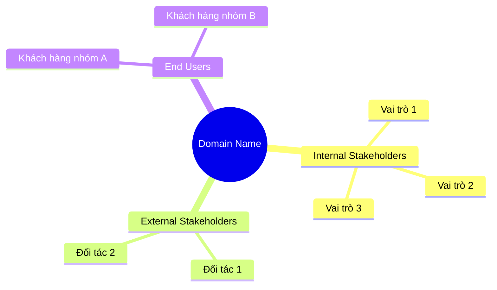
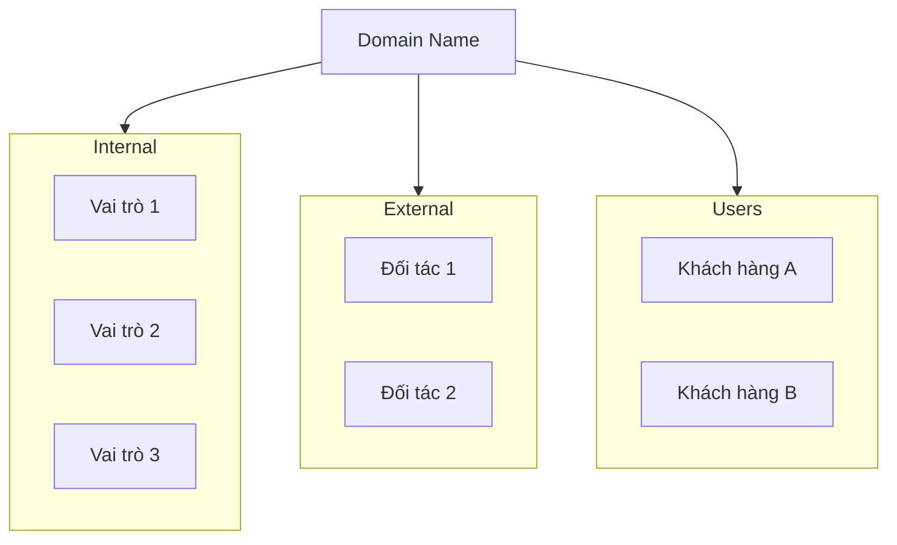
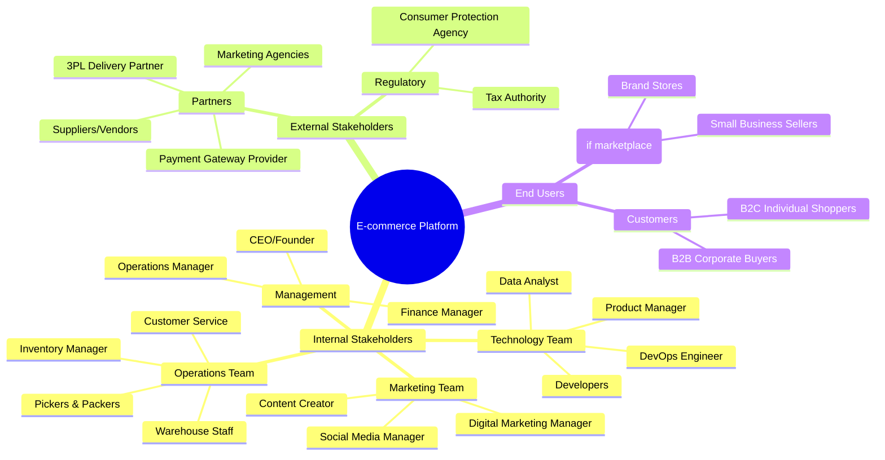

# Bước 4: Stakeholder & Vai trò

## 🎯 Mục tiêu bước này

- Xác định **TẤT CẢ các bên liên quan** (stakeholders) trong domain
- Mô tả **vai trò & trách nhiệm** của từng stakeholder
- Liệt kê **công việc chính** của từng vai trò
- **Mapping phần mềm** hỗ trợ cho từng vai trò

---

## 📝 Các công việc cần làm

### 1. Vẽ Mindmap hoặc Sơ đồ Stakeholder

Sử dụng **mermaid mindmap** để hiển thị tất cả stakeholders.

#### Template Mindmap

#### Hoặc sử dụng Graph

---

### 2. Tạo bảng chi tiết Stakeholder

Với MỖI stakeholder, mô tả chi tiết:

| Stakeholder | Vai trò | Công việc chính | Phần mềm hỗ trợ | Chức năng cần có |
|-------------|---------|-----------------|-----------------|------------------|
| [Tên] | [Mô tả vai trò] | • Công việc 1 • Công việc 2 • Công việc 3 | [Phần mềm/Module] | • Chức năng 1 • Chức năng 2 |

---

### 3. Nhóm Stakeholder

Chia stakeholders thành các nhóm:

#### 🔵 Internal Stakeholders (Nội bộ tổ chức)
- Nhân viên, quản lý, bộ phận khác nhau

#### 🟢 External Stakeholders (Bên ngoài)
- Đối tác, nhà cung cấp, cơ quan quản lý

#### 🟠 End Users (Người dùng cuối)
- Khách hàng, người dùng sản phẩm/dịch vụ

---

## 📊 Ví dụ mẫu (E-commerce)

### 1. Mindmap Stakeholder

---

### 2. Bảng chi tiết Stakeholder

#### 🔵 Internal Stakeholders

| Stakeholder | Vai trò | Công việc chính | Phần mềm hỗ trợ | Chức năng cần có |
|-------------|---------|-----------------|-----------------|------------------|
| **CEO/Founder** | Lãnh đạo doanh nghiệp | • Đặt chiến lược kinh doanh • Giám sát KPI tổng thể • Quyết định đầu tư lớn | **BI Dashboard** | • KPI summary (revenue, profit, growth) • Real-time metrics • Custom reports |
| **Operations Manager** | Quản lý vận hành | • Giám sát quy trình đơn hàng • Tối ưu hiệu suất giao hàng • Quản lý nhân sự operations | **OMS + WMS Dashboard** | • Order fulfillment rate • Warehouse efficiency • Team performance • Bottleneck alerts |
| **Customer Service** | Hỗ trợ khách hàng | • Trả lời thắc mắc (phone/chat/email) • Xử lý khiếu nại • Hỗ trợ đổi trả hàng • Escalate vấn đề phức tạp | **CRM + Helpdesk** | • Ticketing system • Customer history view • Live chat • Knowledge base • Canned responses |
| **Warehouse Staff** | Quản lý kho hàng | • Nhập/xuất hàng • Đóng gói đơn hàng • Kiểm kê định kỳ • Sắp xếp hàng hóa | **WMS** | • Picking list • Barcode scanning • Packing station • Inventory count • Location management |
| **Inventory Manager** | Quản lý tồn kho | • Theo dõi tồn kho • Đặt hàng nhập thêm • Xử lý hàng hết hạn/hư hỏng • Tối ưu stock levels | **IMS (Inventory Management)** | • Stock level alerts • Reorder point automation • ABC analysis • Stock aging report • Demand forecasting |
| **Digital Marketing Manager** | Quản lý marketing online | • Lập kế hoạch campaigns • Phân tích ROI quảng cáo • A/B testing • Budget allocation | **Marketing Automation** | • Campaign dashboard • Ads performance tracking • Attribution modeling • Promo code management |
| **Data Analyst** | Phân tích dữ liệu | • Phân tích hành vi khách hàng • Dự đoán xu hướng • Báo cáo insights cho management • Build dashboards | **BI Tools (Tableau/Power BI)** | • Data warehouse access • SQL query tool • Visualization builder • Scheduled reports |

---

#### 🟢 External Stakeholders

| Stakeholder | Vai trò | Công việc chính | Phần mềm hỗ trợ | Chức năng cần có |
|-------------|---------|-----------------|-----------------|------------------|
| **3PL Delivery Partner** | Vận chuyển hàng hóa | • Nhận đơn hàng cần giao • Phân công shipper • Giao hàng cho khách • Cập nhật trạng thái • Thu COD và chuyển tiền | **TMS + 3PL Portal** | • API nhận orders • Tracking updates webhook • POD upload • COD reconciliation • SLA monitoring |
| **Payment Gateway** | Xử lý thanh toán | • Xử lý giao dịch thẻ/ví điện tử • Chuyển tiền vào tài khoản merchant • Xác thực thanh toán • Phát hiện gian lận | **Payment Integration** | • Payment API (charge, refund) • Webhook payment status • Fraud detection callback • Settlement report |
| **Suppliers/Vendors** | Cung cấp sản phẩm | • Cung cấp hàng hóa • Cập nhật giá & tồn kho • Xử lý đơn đặt hàng • Giao hàng đến kho | **Supplier Portal** | • PO (Purchase Order) management • Inventory sync • Pricing updates • Invoice submission |
| **Tax Authority** | Quản lý thuế | • Yêu cầu báo cáo thuế • Kiểm tra tuân thủ • Thu thuế | **Accounting/ERP** | • Tax calculation • VAT invoice generation • Tax report export • E-invoice integration |

---

#### 🟠 End Users

| Stakeholder | Vai trò | Công việc chính | Phần mềm hỗ trợ | Chức năng cần có |
|-------------|---------|-----------------|-----------------|------------------|
| **B2C Individual Shoppers** | Khách hàng cá nhân | • Duyệt & tìm kiếm sản phẩm • Đặt hàng • Thanh toán • Theo dõi đơn hàng • Đánh giá sản phẩm | **E-commerce Website/App** | • Product catalog • Search & filter • Shopping cart • Checkout • Order tracking • Reviews & ratings |
| **B2B Corporate Buyers** | Khách hàng doanh nghiệp | • Mua số lượng lớn • Yêu cầu báo giá • Thanh toán sau (credit) • Quản lý nhiều người dùng • Theo dõi lịch sử mua hàng | **B2B Portal** | • Bulk order • Quote request • Multi-user accounts • Credit terms • Purchase history • Approval workflow |
| **Sellers (nếu là marketplace)** | Người bán hàng | • Đăng sản phẩm lên platform • Quản lý giá & tồn kho • Xử lý đơn hàng • Theo dõi doanh thu • Rút tiền về tài khoản | **Seller Center** | • Product listing tool • Order management • Inventory sync • Revenue dashboard • Payout management • Commission report |

---

### 3. Phân tích sâu một vai trò quan trọng

#### Vai trò: Customer Service Representative

**Mô tả chi tiết:**
- **Số lượng:** 10-15 người (tùy quy mô)
- **Làm việc:** Shift 8h/ngày, hỗ trợ khách hàng qua phone/chat/email
- **KPI:**
  - First Response Time < 2 phút (chat), < 1 giờ (email)
  - Resolution Rate > 85%
  - Customer Satisfaction (CSAT) > 4.5/5

**Quy trình làm việc hàng ngày:**

1. **Login vào hệ thống CRM** → Xem queue tickets mới
2. **Nhận ticket** → Đọc vấn đề khách hàng
3. **Tra cứu thông tin** → Xem order history, payment status
4. **Giải quyết hoặc escalate:**
   - Trả lời: Tự giải quyết (90% cases)
   - Escalate: Chuyển lên supervisor hoặc technical team (10%)
5. **Đóng ticket** → Gửi survey CSAT
6. **Cuối ca:** Tổng kết số tickets xử lý, CSAT trung bình

**Phần mềm cần có:**

| Phần mềm | Chức năng cụ thể |
|----------|------------------|
| **CRM/Helpdesk** | • Ticketing (create, assign, close) • Customer 360° view (orders, payments, returns) • Canned responses library • Internal notes • SLA tracking |
| **Live Chat** | • Real-time messaging • Chat routing (round-robin/skill-based) • Typing indicator • File attachments |
| **Phone System** | • Click-to-call • Call recording • IVR (Interactive Voice Response) • Call transfer |
| **Knowledge Base** | • FAQ articles • Search internal docs • SOPs (Standard Operating Procedures) |

**Pain points hiện tại:**
- Phải chuyển qua lại nhiều hệ thống (CRM, OMS, WMS) → Cần **unified dashboard**
- Không có suggest response → Cần **AI chatbot hỗ trợ**
- Khó escalate vấn đề phức tạp → Cần **workflow automation**

**AI hỗ trợ:**
- **AI Chatbot:** Tự động trả lời 60-70% câu hỏi thường gặp (tracking order, return policy)
- **Sentiment Analysis:** Phát hiện khách hàng giận dữ → ưu tiên xử lý
- **Response Suggestion:** Gợi ý câu trả lời dựa trên knowledge base

---

## 🤖 AI hỗ trợ Stakeholders

### Internal Stakeholders
- **CEO/Management:** AI-powered BI dashboard với insights tự động
- **Operations:** Predictive analytics dự đoán bottlenecks
- **CS Team:** AI chatbot + response suggestion
- **Warehouse:** Computer vision kiểm tra chất lượng đóng gói

### External Stakeholders
- **3PL Partner:** AI tối ưu route, dự đoán ETA chính xác
- **Suppliers:** Demand forecasting để supplier chuẩn bị hàng trước

### End Users
- **Customers:** Personalization AI, visual search, virtual try-on

---

## ✅ Checklist hoàn thành

- [x] Đã vẽ mindmap/sơ đồ stakeholder
- [x] Đã tạo bảng chi tiết cho TẤT CẢ stakeholders
- [x] Đã phân tích sâu 1-2 vai trò quan trọng
- [x] Đã mapping phần mềm hỗ trợ cho từng vai trò
- [x] Đã mô tả AI hỗ trợ
- [x] Đã cập nhật vào file .md
- [x] User xác nhận tiếp tục Bước 5

---

## 🔗 Bước tiếp theo

→ **[Bước 5: Phân tích sâu quy trình cụ thể](stage-5-deep-dive.md)**