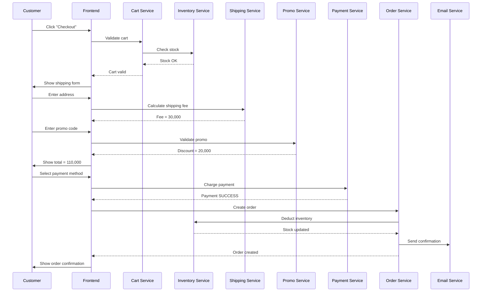

# Bước 5: Phân tích sâu quy trình cụ thể

## 🎯 Mục tiêu bước này

- **Chọn 1 quy trình quan trọng** từ Bước 3 để phân tích CHI TIẾT
- Mô tả **từng bước cụ thể** trong quy trình
- Liệt kê **Input/Output** chi tiết cho mỗi bước
- Xác định **quy tắc nghiệp vụ, ngoại lệ, công thức**
- **Mapping** cách phần mềm vận hành từng bước

---

## 📝 Các công việc cần làm

### 1. Hỏi user chọn quy trình

**BẮT BUỘC:** Trước khi bắt đầu, hỏi user:

```
Từ các quy trình ở Bước 3, bạn muốn phân tích sâu quy trình nào?

Các quy trình có sẵn:
1. [Quy trình 1]
2. [Quy trình 2]
3. [Quy trình 3]
...

Hoặc bạn có thể đề xuất quy trình khác cần phân tích.
```

**Gợi ý chọn quy trình:**
- Quy trình **phức tạp nhất**
- Quy trình có **nhiều quy tắc nghiệp vụ**
- Quy trình **cốt lõi** của domain
- Quy trình user **quan tâm nhất**

---

### 2. Phân tích chi tiết quy trình

#### Cấu trúc phân tích

**Tên quy trình:** [Tên quy trình đã chọn]

**Lý do chọn:**
_Giải thích tại sao chọn quy trình này để phân tích sâu_

**Phạm vi:**
- **Bắt đầu:** [Trigger event]
- **Kết thúc:** [End state]
- **Thời gian trung bình:** [Estimate]

---

### 3. Các bước chi tiết

Với MỖI bước trong quy trình, trình bày dưới dạng bảng:

| Bước | Ai | Làm gì | Thực hiện như thế nào | Input | Output | Quy định/Validate cần lưu ý | Chức năng phần mềm cần có |
|------|----|--------|----------------------|-------|--------|----------------------------|---------------------------|
| 1. [Tên bước] | [Vai trò/Actor] | [Mô tả hành động] | [Cách thức thực hiện, quy trình cụ thể] | [Input chung chung, không chi tiết trường] | [Output chung chung] | • Validate/Quy định 1<br>• Validate/Quy định 2 | • Chức năng 1<br>• Chức năng 2 |

**Lưu ý:**
- **Input/Output:** Chỉ mô tả chung chung (ví dụ: "Thông tin đơn hàng", "Mã vận đơn", "Trạng thái đơn hàng"), KHÔNG liệt kê chi tiết từng trường dữ liệu
- **Thực hiện như thế nào:** Mô tả quy trình cụ thể, các bước con (ví dụ: "Scan mã vận đơn → Validate → Cập nhật trạng thái")
- **Quy định/Validate:** Liệt kê các quy tắc nghiệp vụ, validation rules, điều kiện cần kiểm tra
- **Chức năng phần mềm:** Liệt kê các chức năng cụ thể cần có trên phần mềm để hỗ trợ bước này

---

## 📊 Ví dụ mẫu: Quy trình "Checkout & Thanh toán" (E-commerce)

### 1. Chọn quy trình

**Tên quy trình:** Checkout & Thanh toán

**Lý do chọn:**
- Quy trình cốt lõi, trực tiếp tạo doanh thu
- Có nhiều quy tắc nghiệp vụ phức tạp (promo, shipping, payment)
- Ảnh hưởng lớn đến trải nghiệm khách hàng
- Liên quan nhiều hệ thống (Cart, Inventory, Payment, Shipping)

**Phạm vi:**
- **Bắt đầu:** Khách hàng click "Checkout" từ giỏ hàng
- **Kết thúc:** Đơn hàng được tạo thành công, payment confirmed
- **Thời gian trung bình:** 2-5 phút (nếu smooth), có thể lâu hơn nếu khách hàng do dự

---

### 2. Các bước chi tiết

#### Bước 1: Validate giỏ hàng

| Bước | Ai | Làm gì | Thực hiện như thế nào | Input | Output | Quy định/Validate cần lưu ý | Chức năng phần mềm cần có |
|------|----|--------|----------------------|-------|--------|----------------------------|---------------------------|
| 1. Validate giỏ hàng | Hệ thống (tự động) | Kiểm tra giỏ hàng có hợp lệ không (sản phẩm còn hàng, giá đúng, không có sản phẩm bị xóa) | Lấy thông tin cart → Kiểm tra tồn kho từng sản phẩm → Kiểm tra giá hiện tại → Cập nhật cart nếu có thay đổi → Trả về kết quả validation | Thông tin giỏ hàng (cart_id, cart_items) | Kết quả validation (valid/invalid, danh sách lỗi, cart đã cập nhật) | • Validate tồn kho: quantity trong cart ≤ stock_quantity<br>• Validate giá: price trong cart = current_price<br>• Validate sản phẩm: product.status = 'active'<br>• Nếu tất cả sản phẩm hết hàng → Không cho checkout | • Get cart API<br>• Check inventory API<br>• Get current price API<br>• Update cart API<br>• Error notification UI |

---

#### Bước 2: Nhập thông tin giao hàng

**Mô tả:**
Khách hàng nhập địa chỉ giao hàng, thông tin người nhận.

**Ai thực hiện:**
Khách hàng (manual input) + Hệ thống (auto-fill nếu đã có địa chỉ)

**Input:**
- Họ tên người nhận (từ User input hoặc User profile)
- Số điện thoại người nhận (từ User input hoặc User profile)
- Địa chỉ giao hàng (từ User input hoặc User profile)
- Tỉnh/Thành phố (từ User input hoặc User profile)
- Quận/Huyện (từ User input hoặc User profile)

**Output:**
- Thông tin giao hàng → Bước 3 (Tính phí vận chuyển)

**Quy tắc nghiệp vụ:**

1. **Rule: Validate số điện thoại**
   - Điều kiện: Phone number phải 10 chữ số, bắt đầu bằng 0
   - Regex: `^0\d{9}$`
   - Ví dụ: "0901234567" ✅, "123456" ❌

2. **Rule: Địa chỉ trong vùng phục vụ**
   - Điều kiện: city_id phải nằm trong danh sách vùng phục vụ
   - Hành động: Nếu không phục vụ → Hiển thị "Hiện chưa giao hàng đến khu vực này"

3. **Rule: Auto-fill cho user đã đăng nhập**
   - Điều kiện: Nếu user_id exists và có saved_addresses
   - Hành động: Hiển thị dropdown chọn địa chỉ có sẵn, hoặc "Thêm địa chỉ mới"

**Ngoại lệ:**

| Ngoại lệ | Nguyên nhân | Cách xử lý | Ai xử lý | Phần mềm hỗ trợ |
|----------|-------------|------------|----------|-----------------|
| Địa chỉ không hợp lệ | Nhập sai định dạng, địa chỉ không tồn tại | Validate front-end + back-end, hiển thị lỗi cụ thể | Khách hàng sửa | Google Maps API (validate địa chỉ) |
| Vùng không giao hàng | Chọn tỉnh/huyện xa | Thông báo "Chưa hỗ trợ", gợi ý địa chỉ gần nhất | Khách hàng | Coverage map |

**Công thức nghiệp vụ:**
_Không có_

**Cơ hội cải tiến:**
- **AI Address Autocomplete:** Gợi ý địa chỉ khi gõ (như Google Maps)
- **Smart Location Detection:** Dùng GPS nếu khách hàng ở gần (mobile app)

**Quy định cần tuân thủ:**
- GDPR/PDPA: Phải có consent để lưu địa chỉ của khách hàng

**Mapping phần mềm:**

| Nghiệp vụ | Chức năng phần mềm | Module | Màn hình/API | Dữ liệu lưu trữ |
|-----------|--------------------|---------|--------------|-----------------|
| Hiển thị form nhập địa chỉ | Shipping info form | Checkout Module | Checkout page (step 1/3) | N/A (form UI) |
| Load địa chỉ đã lưu | Get saved addresses | User Service | GET /api/users/{user_id}/addresses | user_addresses table (address_id, user_id, name, phone, address, city_id, district_id, is_default) |
| Validate địa chỉ | Address validation | Address Service | POST /api/address/validate | N/A (use 3rd party API) |
| Lưu địa chỉ mới | Save address | User Service | POST /api/users/{user_id}/addresses | user_addresses table (insert new row) |

---

#### Bước 3: Tính phí vận chuyển & áp dụng khuyến mãi

**Mô tả:**
Hệ thống tính phí ship dựa trên địa chỉ, khối lượng. Khách hàng nhập mã khuyến mãi (nếu có).

**Ai thực hiện:**
Hệ thống (tự động tính) + Khách hàng (nhập promo code)

**Input:**
- Thông tin giỏ hàng (từ Bước 1)
- Thông tin giao hàng (từ Bước 2)
- Mã khuyến mãi (từ User input)

**Output:**
- Tổng tiền sản phẩm → Order summary
- Phí vận chuyển → Order summary
- Giảm giá → Order summary
- Thuế → Order summary
| total | Decimal | Order summary + Payment | Number | 110000 (VND) |

**Quy tắc nghiệp vụ:**

1. **Rule: Tính phí ship**

   **Công thức:**
   ```
   shipping_fee = base_fee + distance_fee + weight_fee

   Trong đó:
   - base_fee:
     - Nội thành (city_id = 1): 15,000 VND
     - Ngoại thành (city_id != 1): 25,000 VND
   - distance_fee:
     - Nếu distance > 10km: (distance - 10) × 1,000 VND/km
     - Nếu distance ≤ 10km: 0
   - weight_fee:
     - Nếu total_weight > 1kg: (total_weight - 1) × 2,000 VND/kg
     - Nếu total_weight ≤ 1kg: 0

   Ví dụ:
   - Giao nội thành HCM (distance = 8km), 0.8kg
   → 15,000 + 0 + 0 = 15,000 VND

   - Giao ngoại thành (distance = 15km), 2kg
   → 25,000 + (15-10)×1,000 + (2-1)×2,000
   → 25,000 + 5,000 + 2,000 = 32,000 VND
   ```

2. **Rule: Miễn phí ship**
   - Điều kiện: Nếu subtotal ≥ 500,000 VND
   - Hành động: shipping_fee = 0
   - Hiển thị: "🎉 Miễn phí vận chuyển cho đơn từ 500k"

3. **Rule: Áp dụng promo code**

   **Các loại promo:**
   - **Percentage discount:** Giảm X% tổng đơn hàng
     - Ví dụ: "SALE20" → Giảm 20% subtotal, tối đa 100,000 VND
   - **Fixed discount:** Giảm X VND
     - Ví dụ: "DISCOUNT50K" → Giảm 50,000 VND
   - **Free shipping:** Miễn phí ship
     - Ví dụ: "FREESHIP" → shipping_fee = 0
   - **Buy X Get Y:** Mua X sản phẩm tặng Y sản phẩm
     - Ví dụ: "BUY2GET1" → Mua 2 tặng 1 (sản phẩm rẻ nhất free)

   **Validation promo code:**
   - Kiểm tra code tồn tại trong database
   - Kiểm tra còn hiệu lực (start_date ≤ now ≤ end_date)
   - Kiểm tra số lần sử dụng (usage_count < usage_limit)
   - Kiểm tra user đã dùng chưa (nếu promo chỉ cho user mới/1 lần/user)
   - Kiểm tra điều kiện tối thiểu (min_order_value)
   - Kiểm tra sản phẩm áp dụng (applicable_products hoặc applicable_categories)

**Ngoại lệ:**

| Ngoại lệ | Nguyên nhân | Cách xử lý | Ai xử lý | Phần mềm hỗ trợ |
|----------|-------------|------------|----------|-----------------|
| Promo code không hợp lệ | Code sai, hết hạn, đã dùng hết | Hiển thị "Mã không hợp lệ hoặc đã hết hạn" | Khách hàng nhập lại | Promo Service validate |
| Đơn hàng không đủ điều kiện | subtotal < min_order_value của promo | Hiển thị "Đơn hàng cần tối thiểu X VND để dùng mã này" | Khách hàng | Promo Service |
| Nhiều promo conflict | User nhập 2 promo không kết hợp được | Chỉ cho nhập 1 promo, hoặc chọn promo có lợi nhất | Hệ thống auto-select best | Promo logic |

**Cơ hội cải tiến:**
- **AI Promo Recommendation:** Gợi ý promo tốt nhất cho khách hàng (không cần nhập code)
- **Dynamic Pricing:** Điều chỉnh giá/promo theo nhu cầu real-time

**Quy định cần tuân thủ:**
- Luật Thương mại: Phải công khai điều kiện khuyến mãi, không được lừa đảo

**Mapping phần mềm:**

| Nghiệp vụ | Chức năng phần mềm | Module | Màn hình/API | Dữ liệu lưu trữ |
|-----------|--------------------|---------|--------------|-----------------|
| Tính phí ship | Calculate shipping fee | Shipping Service | POST /api/shipping/calculate | shipping_rules table (city_id, base_fee, distance_rate, weight_rate) |
| Nhập promo code | Promo code input | Checkout Module | Checkout page (promo input) | N/A (form) |
| Validate promo | Validate promo code | Promo Service | POST /api/promo/validate | promo_codes table (code, type, value, start_date, end_date, usage_limit, usage_count, min_order_value, applicable_products) + promo_usage table (user_id, promo_id, used_at) |
| Tính discount | Apply promo logic | Order Service | Internal calculation | N/A (runtime calculation) |
| Hiển thị order summary | Order summary UI | Checkout Module | Checkout page (step 2/3) | N/A (UI display) |

---

#### Bước 4: Thanh toán

**Mô tả:**
Khách hàng chọn phương thức thanh toán, thực hiện thanh toán.

**Ai thực hiện:**
Khách hàng + Payment Gateway + Hệ thống

**Input:**
- Tổng tiền đơn hàng (từ Bước 3)
- Phương thức thanh toán (từ User selection)
- Thông tin thẻ (từ User input, nếu chọn thanh toán online)

**Output:**
- Trạng thái thanh toán → Bước 5 (Tạo đơn hàng)
- Mã giao dịch → Database
- Mã đơn hàng → Trang xác nhận đơn hàng

**Quy tắc nghiệp vụ:**

1. **Rule: COD (Cash on Delivery)**
   - Không cần xác thực thanh toán trước
   - payment_status = "PENDING"
   - Tiền sẽ thu khi giao hàng

2. **Rule: Online Payment (Card/Wallet)**
   - Gọi Payment Gateway API
   - Nếu success → payment_status = "SUCCESS"
   - Nếu failed → payment_status = "FAILED", không tạo đơn hàng

3. **Rule: Payment timeout**
   - User có 15 phút để hoàn thành thanh toán online
   - Sau 15 phút → Cancel payment session

4. **Rule: Fraud detection**
   - Nếu Payment Gateway trả về "suspected_fraud" → Block payment, yêu cầu verify
   - Kiểm tra: IP, card BIN, velocity (số lần thanh toán/giờ)

**Ngoại lệ:**

| Ngoại lệ | Nguyên nhân | Cách xử lý | Ai xử lý | Phần mềm hỗ trợ |
|----------|-------------|------------|----------|-----------------|
| Thanh toán thất bại | Card declined, insufficient funds, network error | Hiển thị lỗi cụ thể, cho phép thử lại hoặc đổi phương thức | Khách hàng | Payment Gateway error handling |
| Payment Gateway down | Sự cố hệ thống PG | Hiển thị "Hệ thống thanh toán tạm gián đoạn", gợi ý COD | Khách hàng chọn COD | Monitoring + fallback |
| 3D Secure failed | User không verify OTP | Hiển thị "Xác thực thất bại", yêu cầu thử lại | Khách hàng | 3DS flow |

**Công thức nghiệp vụ:**
_Không có (payment gateway xử lý)_

**Cơ hội cải tiến:**
- **1-Click Payment:** Lưu thông tin thẻ (tokenization) để thanh toán nhanh lần sau
- **Buy Now Pay Later (BNPL):** Tích hợp Fundiin, Kredivo

**Quy định cần tuân thủ:**
- PCI-DSS: Không được lưu thông tin thẻ raw (chỉ lưu token)
- 3D Secure: Bắt buộc xác thực cho giao dịch > 500k (tùy ngân hàng)

**Mapping phần mềm:**

| Nghiệp vụ | Chức năng phần mềm | Module | Màn hình/API | Dữ liệu lưu trữ |
|-----------|--------------------|---------|--------------|-----------------|
| Chọn phương thức thanh toán | Payment method selection | Checkout Module | Checkout page (step 3/3) | N/A (form) |
| Nhập thông tin thẻ | Card input form | Payment Module | Payment iframe (hosted by PG) | N/A (không lưu, gửi trực tiếp PG) |
| Gọi Payment Gateway | Charge payment | Payment Service | POST /api/payment/charge → PG API | payments table (payment_id, order_id, method, amount, status, transaction_id, created_at) |
| Nhận webhook từ PG | Payment confirmation webhook | Payment Service | POST /webhook/payment (from PG) | payments table (update status) |
| Hiển thị kết quả | Payment result page | Checkout Module | Success/Failure page | N/A (UI) |

---

#### Bước 5: Tạo đơn hàng

**Mô tả:**
Sau khi thanh toán thành công (hoặc chọn COD), hệ thống tạo đơn hàng và trừ tồn kho.

**Ai thực hiện:**
Hệ thống (tự động)

**Input:**
- Thông tin giỏ hàng (từ Bước 1)
- Thông tin giao hàng (từ Bước 2)
- Trạng thái thanh toán (từ Bước 4)
- Mã thanh toán (từ Bước 4)

**Output:**
- Mã đơn hàng → Email xác nhận, Tracking
- Số đơn hàng → Hiển thị cho khách hàng
- Trạng thái đơn hàng → Tracking đơn hàng

**Quy tắc nghiệp vụ:**

1. **Rule: Atomic transaction**
   - Tạo đơn hàng + Trừ tồn kho phải trong 1 transaction database
   - Nếu 1 trong 2 thất bại → Rollback toàn bộ

2. **Rule: Trừ tồn kho**
   - Với mỗi product trong cart:
     ```
     products.stock_quantity = stock_quantity - cart_item.quantity
     ```
   - Nếu stock_quantity < 0 sau khi trừ → Rollback, thông báo lỗi

3. **Rule: Order number generation**
   - Format: ORD-YYYYMMDD-XXXX
   - XXXX = auto-increment trong ngày (reset mỗi ngày)

4. **Rule: Notification**
   - Gửi email/SMS xác nhận đơn hàng cho khách
   - Gửi notification cho team operations (có đơn mới cần xử lý)

**Ngoại lệ:**

| Ngoại lệ | Nguyên nhân | Cách xử lý | Ai xử lý | Phần mềm hỗ trợ |
|----------|-------------|------------|----------|-----------------|
| Tồn kho không đủ | Race condition (nhiều người mua cùng lúc) | Rollback transaction, thông báo "Sản phẩm vừa hết hàng", hoàn tiền nếu đã thanh toán | Hệ thống + CS Team | Inventory lock mechanism |
| Database error | DB connection timeout, disk full | Retry 3 lần, nếu fail → Email alert cho dev team, thông báo khách "Lỗi hệ thống" | Dev Team | Monitoring (Sentry, Datadog) |

**Công thức nghiệp vụ:**
_Không có_

**Cơ hội cải tiến:**
- **Reserve inventory:** Lock tồn kho trong 15 phút khi khách vào checkout (tránh oversell)
- **Async processing:** Tạo đơn hàng async để không block user experience

**Quy định cần tuân thủ:**
- Luật Bảo vệ Quyền lợi người tiêu dùng: Phải cung cấp hóa đơn/biên lai điện tử

**Mapping phần mềm:**

| Nghiệp vụ | Chức năng phần mềm | Module | Màn hình/API | Dữ liệu lưu trữ |
|-----------|--------------------|---------|--------------|-----------------|
| Tạo đơn hàng | Create order | Order Service | POST /api/orders | orders table (order_id, user_id, order_number, status, subtotal, shipping_fee, discount, tax, total, payment_id, created_at) + order_items table (order_id, product_id, quantity, price) + shipping_addresses table (order_id, name, phone, address) |
| Trừ tồn kho | Deduct inventory | Inventory Service | Internal API | products table (stock_quantity -= quantity) + inventory_transactions table (product_id, type="SALE", quantity, order_id, timestamp) |
| Gửi email xác nhận | Send order confirmation | Notification Service | Email queue | N/A (email sent via SendGrid/AWS SES) |
| Gửi SMS | Send SMS | Notification Service | SMS queue | N/A (SMS sent via Twilio/SMSAPI) |
| Hiển thị order confirmation | Order success page | Checkout Module | Order confirmation page | N/A (query order data for display) |

---

### 3. Tổng kết quy trình

**Workflow diagram:**



**Thời gian ước tính:**
- Bước 1 (Validate): < 1 giây
- Bước 2 (Shipping info): 30-60 giây (user input)
- Bước 3 (Calculate): 1-2 giây
- Bước 4 (Payment): 10-30 giây (nếu online payment)
- Bước 5 (Create order): 2-3 giây

**Tổng:** 2-5 phút (nếu mọi thứ suôn sẻ)

---

## 🤖 AI hỗ trợ quy trình

### Bước 1: Validate
- **Anomaly Detection:** Phát hiện hành vi bất thường (bot, fraud)

### Bước 2: Shipping info
- **Address Autocomplete:** Gợi ý địa chỉ thông minh
- **Smart Default:** Dự đoán địa chỉ khách muốn dùng (dựa trên lịch sử)

### Bước 3: Promo
- **Promo Recommendation:** Gợi ý promo tốt nhất tự động
- **Dynamic Pricing:** Điều chỉnh giá/promo theo nhu cầu

### Bước 4: Payment
- **Fraud Detection:** AI phát hiện giao dịch gian lận
- **Payment Success Prediction:** Dự đoán payment có thành công không (để gợi ý phương thức khác)

### Bước 5: Create order
- **Inventory Forecasting:** Dự đoán nhu cầu để tránh oversell

---

## ✅ Checklist hoàn thành

- [x] Đã chọn 1 quy trình quan trọng
- [x] Đã phân tích chi tiết 4-7 bước trong quy trình
- [x] Mỗi bước có đầy đủ: Input/Output, Rules, Exceptions, Formula, Mapping
- [x] Đã vẽ sequence diagram tổng kết
- [x] Đã mô tả AI hỗ trợ
- [x] Đã cập nhật vào file .md
- [x] User xác nhận tiếp tục Bước 6

---

## 🔗 Bước tiếp theo

→ **[Bước 6: Ứng dụng & Chức năng](stage-6-applications.md)**