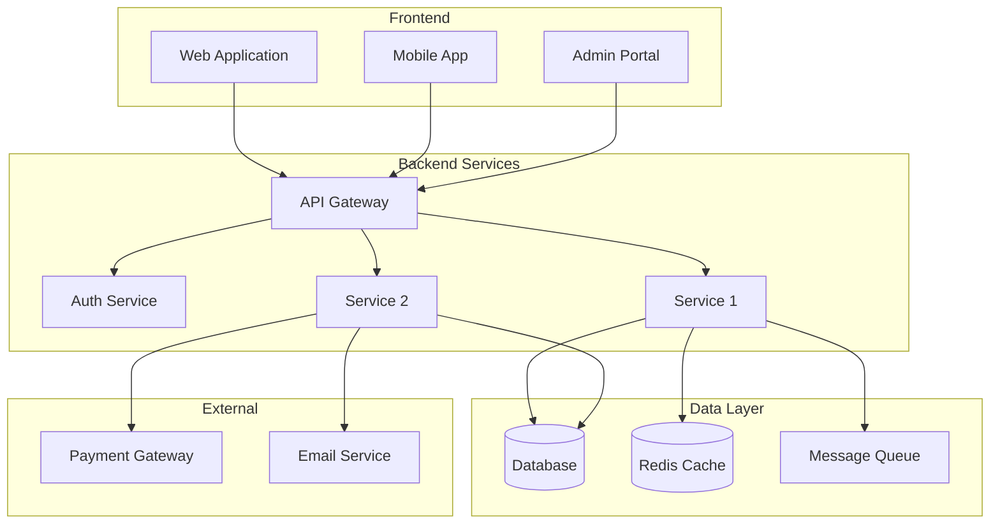

# Bước 6: Ứng dụng & Chức năng

## 🎯 Mục tiêu bước này

- Xác định **hệ thống phần mềm hoàn chỉnh** cần có để vận hành domain
- Liệt kê **các ứng dụng/module chính**
- Mô tả **giao diện** và **chức năng cốt lõi**
- Tạo **bảng tổng hợp chức năng** chi tiết (tiếng Việt)

---

## 📝 Các công việc cần làm

### 1. Vẽ kiến trúc hệ thống tổng quan

Sử dụng **mermaid diagram** để vẽ kiến trúc phần mềm tổng thể.

#### Template

---

### 2. Liệt kê danh sách ứng dụng & module

Với MỖI ứng dụng/module:

#### Ứng dụng X: [Tên ứng dụng]

**Mục đích:**
_Mô tả ngắn gọn ứng dụng này phục vụ cho ai, làm gì_

**Người dùng:**
- Vai trò 1
- Vai trò 2

**Module chính:**

| Module | Mô tả | Chức năng cốt lõi | Ý nghĩa |
|--------|-------|-------------------|---------|
| [Module 1] | [1-2 câu mô tả] | • Chức năng 1 • Chức năng 2 • Chức năng 3 | [Giá trị/lý do cần có] |
| [Module 2] | ... | ... | ... |

**Giao diện chính:**

| Màn hình | Loại | Người dùng | Chức năng | Ý nghĩa |
|----------|------|------------|-----------|---------|
| [Screen 1] | [List/Form/Dashboard] | [Role] | [Mô tả chức năng] | [Giá trị] |
| [Screen 2] | ... | ... | ... | ... |

**Công nghệ đề xuất:**
- Frontend: [React/Vue/Angular]
- Backend: [Node.js/Python/Java]
- Database: [PostgreSQL/MySQL/MongoDB]

---

### 3. Tạo bảng tổng hợp chức năng

Bảng tổng hợp TẤT CẢ chức năng trong hệ thống:

| STT | Module | Chức năng | Mô tả chi tiết | Ý nghĩa | Độ ưu tiên |
|-----|--------|-----------|----------------|---------|------------|
| 1 | [Module] | [Tên chức năng] | [Mô tả 1-2 câu] | [Giá trị nghiệp vụ] | High/Medium/Low |

**Độ ưu tiên:**
- **High:** Chức năng cốt lõi, không thể thiếu (MVP)
- **Medium:** Chức năng quan trọng, nên có
- **Low:** Chức năng bổ sung, có thì tốt

---

## 📊 Ví dụ mẫu (E-commerce Platform)

### 1. Kiến trúc hệ thống tổng quan

```mermaid
graph TB
    subgraph "User-Facing Applications"
        WEB[E-commerce Website]
        MOBILE[Mobile App iOS/Android]
        PWA[Progressive Web App]
    end

    subgraph "Internal Applications"
        ADMIN[Admin Dashboard]
        OPS[Operations Portal]
        WMS_UI[Warehouse Management UI]
        CS[Customer Service Portal]
    end

    subgraph "Backend Microservices"
        API[API Gateway]
        AUTH[Auth Service]
        USER[User Service]
        PRODUCT[Product Service]
        CART[Cart Service]
        ORDER[Order Service]
        PAYMENT[Payment Service]
        SHIPPING[Shipping Service]
        INVENTORY[Inventory Service]
        NOTIFICATION[Notification Service]
        ANALYTICS[Analytics Service]
    end

    subgraph "Data Layer"
        POSTGRES[(PostgreSQL<br/>Transactional DB)]
        MONGO[(MongoDB<br/>Product Catalog)]
        REDIS[(Redis<br/>Cache & Session)]
        ES[(Elasticsearch<br/>Search Engine)]
    end

    subgraph "Message Queue"
        QUEUE[RabbitMQ/<br/>Kafka]
    end

    subgraph "External Services"
        PG[Payment Gateways<br/>VNPay, Momo, Stripe]
        3PL[3PL Partners<br/>GHN, GHTK, Viettel Post]
        EMAIL[Email Service<br/>SendGrid]
        SMS[SMS Service<br/>Twilio]
        CDN[CDN<br/>Cloudflare]
    end

    WEB --> API
    MOBILE --> API
    PWA --> API
    ADMIN --> API
    OPS --> API
    WMS_UI --> API
    CS --> API

    API --> AUTH
    API --> USER
    API --> PRODUCT
    API --> CART
    API --> ORDER
    API --> PAYMENT
    API --> SHIPPING
    API --> INVENTORY
    API --> NOTIFICATION
    API --> ANALYTICS

    USER --> POSTGRES
    ORDER --> POSTGRES
    PAYMENT --> POSTGRES
    PRODUCT --> MONGO
    INVENTORY --> POSTGRES

    CART --> REDIS
    AUTH --> REDIS

    PRODUCT --> ES

    ORDER --> QUEUE
    NOTIFICATION --> QUEUE
    SHIPPING --> QUEUE

    PAYMENT --> PG
    SHIPPING --> 3PL
    NOTIFICATION --> EMAIL
    NOTIFICATION --> SMS
    WEB --> CDN
```

---

### 2. Danh sách ứng dụng & module

#### 🔵 Ứng dụng 1: E-commerce Website (B2C)

**Mục đích:**
Website chính cho khách hàng cá nhân duyệt sản phẩm, đặt hàng, thanh toán.

**Người dùng:**
- Khách hàng cá nhân (B2C)
- Khách vãng lai (guest checkout)

**Module chính:**

| Module | Mô tả | Chức năng cốt lõi | Ý nghĩa |
|--------|-------|-------------------|---------|
| **Product Catalog** | Hiển thị danh sách sản phẩm, chi tiết sản phẩm | • Listing page (PLP) • Product detail page (PDP) • Category navigation • Product images & videos • Reviews & ratings | Giúp khách hàng duyệt và tìm hiểu sản phẩm |
| **Search & Filter** | Tìm kiếm và lọc sản phẩm | • Full-text search • Autocomplete • Advanced filters (price, brand, attributes) • Sort (price, popularity, new arrivals) | Giúp khách hàng tìm sản phẩm nhanh chóng |
| **Shopping Cart** | Quản lý giỏ hàng | • Add/remove/update items • Save cart for later • Estimate shipping • Apply promo code | Cho phép khách hàng tích lũy sản phẩm trước khi mua |
| **Checkout** | Thanh toán đơn hàng | • Multi-step checkout • Guest checkout • Address management • Payment method selection • Order summary | Hoàn tất giao dịch mua hàng |
| **User Account** | Quản lý tài khoản khách hàng | • Profile management • Order history • Wishlist • Saved addresses • Loyalty points | Tăng trải nghiệm và giữ chân khách hàng |
| **Content Pages** | Nội dung marketing & support | • Homepage • Promotions/Campaigns • About Us • FAQ/Help Center • Blog | Cung cấp thông tin và hỗ trợ khách hàng |

**Giao diện chính:**

| Màn hình | Loại | Người dùng | Chức năng | Ý nghĩa |
|----------|------|------------|-----------|---------|
| Homepage | Landing | Tất cả | Banner carousel, featured products, categories, promotions | Landing page thu hút khách hàng |
| Product Listing | List | Tất cả | Hiển thị danh sách sản phẩm với filter/sort | Duyệt catalog |
| Product Detail | Detail | Tất cả | Thông tin chi tiết sản phẩm, images, reviews, add to cart | Xem chi tiết trước khi mua |
| Shopping Cart | Form | Tất cả | Danh sách sản phẩm trong cart, update quantity, estimate total | Quản lý giỏ hàng |
| Checkout | Multi-step form | Tất cả | Shipping → Payment → Review | Hoàn tất đơn hàng |
| Order Tracking | Dashboard | Khách hàng | Xem trạng thái đơn hàng, tracking map | Theo dõi đơn hàng |
| My Account | Dashboard | Khách hàng | Profile, orders, wishlist, addresses | Quản lý tài khoản |

**Công nghệ đề xuất:**
- Frontend: React + Next.js (SSR for SEO)
- State Management: Redux / Zustand
- Styling: Tailwind CSS / Material-UI
- API: RESTful API / GraphQL
- Hosting: Vercel / AWS Amplify

---

#### 🟢 Ứng dụng 2: Admin Dashboard

**Mục đích:**
Công cụ quản lý nội bộ cho admin, operations, marketing.

**Người dùng:**
- Admin (superuser)
- Operations Manager
- Marketing Manager
- Customer Service

**Module chính:**

| Module | Mô tả | Chức năng cốt lõi | Ý nghĩa |
|--------|-------|-------------------|---------|
| **Dashboard** | Tổng quan KPIs | • Revenue, orders, traffic metrics • Charts & graphs • Real-time updates | Giám sát tình hình kinh doanh |
| **Product Management** | Quản lý catalog | • Create/edit/delete products • Bulk upload (CSV/Excel) • Inventory management • Pricing & promotions | Quản lý kho sản phẩm |
| **Order Management** | Quản lý đơn hàng | • Order list (filter, search) • Order detail view • Status updates • Cancel/refund orders | Xử lý đơn hàng |
| **Customer Management** | Quản lý khách hàng | • Customer list • Customer detail (orders, lifetime value) • Segmentation • Export data | Quản lý quan hệ khách hàng |
| **Marketing** | Công cụ marketing | • Promo code creation • Campaign management • Email marketing • Banner/content management | Thực hiện chiến dịch marketing |
| **Reports & Analytics** | Báo cáo & phân tích | • Sales reports • Inventory reports • Customer reports • Custom reports • Export Excel/PDF | Ra quyết định dựa trên dữ liệu |
| **Settings** | Cài đặt hệ thống | • User management (RBAC) • System configuration • Payment/shipping settings • Tax settings | Cấu hình hệ thống |

**Giao diện chính:**

| Màn hình | Loại | Người dùng | Chức năng | Ý nghĩa |
|----------|------|------------|-----------|---------|
| Dashboard | Dashboard | Tất cả | KPI cards, charts, recent activities | Tổng quan tình hình |
| Product List | List | Admin, Ops | Danh sách sản phẩm với actions (edit, delete, publish) | Quản lý catalog |
| Product Create/Edit | Form | Admin, Ops | Form nhập thông tin sản phẩm (name, price, images, specs) | Tạo/sửa sản phẩm |
| Order List | List | Admin, Ops, CS | Danh sách đơn hàng với filter (status, date, customer) | Quản lý orders |
| Order Detail | Detail | Admin, Ops, CS | Chi tiết đơn hàng, timeline, actions (cancel, refund, ship) | Xử lý đơn hàng |
| Customer List | List | Admin, CS | Danh sách khách hàng với search & filter | Quản lý KH |
| Promo Code Manager | List + Form | Admin, Marketing | Tạo/sửa promo codes, usage stats | Quản lý khuyến mãi |
| Sales Report | Report | Admin, Management | Charts, tables, export | Phân tích doanh số |

**Công nghệ đề xuất:**
- Frontend: React + Ant Design / Material-UI
- State Management: Redux Toolkit
- Charts: Recharts / Chart.js
- API: RESTful API
- Hosting: AWS S3 + CloudFront / Vercel

---

#### 🟠 Ứng dụng 3: Warehouse Management System (WMS)

**Mục đích:**
Quản lý kho hàng, xử lý đơn hàng (pick, pack, ship).

**Người dùng:**
- Warehouse staff (pickers, packers)
- Inventory manager

**Module chính:**

| Module | Mô tả | Chức năng cốt lõi | Ý nghĩa |
|--------|-------|-------------------|---------|
| **Inbound** | Nhập hàng vào kho | • Receive PO (Purchase Orders) • Scan & verify items • Put away (assign location) • Quality check | Quản lý hàng nhập |
| **Outbound** | Xuất hàng (fulfillment) | • Picking list • Batch picking optimization • Packing station • Label printing • Handover to shipper | Xử lý đơn hàng |
| **Inventory** | Quản lý tồn kho | • Stock levels (real-time) • Stock movement history • Cycle count • Stock transfer between warehouses • Alert low stock | Theo dõi tồn kho |
| **Location Management** | Quản lý vị trí trong kho | • Bin/rack/shelf mapping • Slotting optimization • Zone management | Tối ưu không gian kho |

**Giao diện chính:**

| Màn hình | Loại | Người dùng | Chức năng | Ý nghĩa |
|----------|------|------------|-----------|---------|
| Picking Queue | List | Picker | Danh sách đơn hàng cần pick, tối ưu route trong kho | Hướng dẫn picker |
| Picking Detail | Detail + Scanner | Picker | Chi tiết sản phẩm cần lấy, scan barcode xác nhận | Đảm bảo pick đúng |
| Packing Station | Form + Scanner | Packer | Scan sản phẩm, đóng gói, in label, cân khối lượng | Đóng gói đơn hàng |
| Inventory Dashboard | Dashboard | Inventory Manager | Tồn kho theo sản phẩm/vị trí, alerts, stock aging | Giám sát tồn kho |
| Receiving | Form + Scanner | Warehouse staff | Nhập hàng từ supplier, scan & verify, put away | Nhập hàng vào kho |

**Công nghệ đề xuất:**
- Frontend: React + Mobile-friendly UI (responsive)
- Hardware: Barcode scanners, thermal printers
- API: RESTful API
- Deployment: Tablet devices (Android/iOS) hoặc Desktop

---

#### 🔴 Ứng dụng 4: Mobile App (iOS & Android)

**Mục đích:**
Ứng dụng di động cho khách hàng mua sắm mọi lúc, mọi nơi.

**Người dùng:**
- Khách hàng cá nhân (B2C)

**Module chính:**

| Module | Mô tả | Chức năng cốt lõi | Ý nghĩa |
|--------|-------|-------------------|---------|
| **Product Browsing** | Duyệt sản phẩm | • Tương tự website • Swipe gestures • Pull to refresh • Image zoom | Trải nghiệm mobile-first |
| **Quick Checkout** | Thanh toán nhanh | • 1-tap checkout • Saved payment methods • Face/Touch ID authentication | Tăng conversion rate |
| **Push Notifications** | Thông báo đẩy | • Order updates • Promo notifications • Abandoned cart reminders | Tăng engagement & retention |
| **QR Code Scanner** | Quét mã QR | • Scan product QR → product detail • Scan promo QR → apply discount | Trải nghiệm O2O (online-to-offline) |
| **GPS Location** | Định vị | • Detect current address • Find nearest warehouse/store • Track delivery on map | Cá nhân hóa trải nghiệm |

**Giao diện chính:**
_Tương tự website nhưng tối ưu cho mobile (bottom navigation, swipe, gestures)_

**Công nghệ đề xuất:**
- Cross-platform: React Native / Flutter
- Native: Swift (iOS) + Kotlin (Android)
- Push Notifications: Firebase Cloud Messaging
- Analytics: Firebase Analytics / Mixpanel

---

### 3. Bảng tổng hợp chức năng

| STT | Module | Chức năng | Mô tả chi tiết | Ý nghĩa | Độ ưu tiên |
|-----|--------|-----------|----------------|---------|------------|
| 1 | Product Catalog | Xem danh sách sản phẩm | Hiển thị danh sách sản phẩm theo category, với pagination, sort, filter | Khách hàng duyệt catalog | High |
| 2 | Product Catalog | Xem chi tiết sản phẩm | Hiển thị thông tin chi tiết: tên, giá, mô tả, hình ảnh, specs, reviews | Khách hàng tìm hiểu sản phẩm trước khi mua | High |
| 3 | Search | Tìm kiếm sản phẩm | Full-text search với autocomplete, xử lý typo, từ đồng nghĩa | Khách hàng tìm sản phẩm nhanh | High |
| 4 | Search | Lọc sản phẩm | Filter theo giá, brand, category, attributes (size, color, v.v.) | Khách hàng thu hẹp kết quả | High |
| 5 | Cart | Thêm sản phẩm vào giỏ hàng | Khách hàng click "Add to cart", sản phẩm được lưu vào cart | Tích lũy sản phẩm trước khi mua | High |
| 6 | Cart | Xem giỏ hàng | Hiển thị danh sách sản phẩm trong cart, subtotal, shipping estimate | Khách hàng review trước khi checkout | High |
| 7 | Cart | Cập nhật số lượng | Tăng/giảm quantity hoặc xóa sản phẩm khỏi cart | Khách hàng điều chỉnh đơn hàng | High |
| 8 | Checkout | Nhập địa chỉ giao hàng | Form nhập hoặc chọn địa chỉ đã lưu | Xác định nơi giao hàng | High |
| 9 | Checkout | Tính phí vận chuyển | Tự động tính shipping fee dựa trên địa chỉ, khối lượng | Khách hàng biết chi phí cuối cùng | High |
| 10 | Checkout | Áp dụng mã khuyến mãi | Nhập promo code, validate, apply discount | Tăng giá trị cho khách hàng | High |
| 11 | Checkout | Chọn phương thức thanh toán | Chọn COD, thẻ, ví điện tử | Linh hoạt thanh toán | High |
| 12 | Checkout | Thanh toán | Xử lý payment qua gateway (nếu online), confirm đơn hàng | Hoàn tất giao dịch | High |
| 13 | Order | Xem lịch sử đơn hàng | Hiển thị danh sách đơn hàng đã đặt (với filter by status, date) | Khách hàng theo dõi đơn hàng | High |
| 14 | Order | Xem chi tiết đơn hàng | Thông tin đầy đủ: sản phẩm, giá, địa chỉ, payment, tracking | Khách hàng xem chi tiết đơn | High |
| 15 | Order | Tracking đơn hàng | Cập nhật trạng thái real-time (Confirmed → Packed → Shipped → Delivered) | Khách hàng biết đơn hàng đang ở đâu | High |
| 16 | Order | Hủy đơn hàng | Khách hàng có thể hủy đơn (nếu chưa ship), hoàn tiền nếu đã thanh toán | Linh hoạt cho khách hàng | Medium |
| 17 | Returns | Yêu cầu trả hàng | Form tạo return request (chọn sản phẩm, lý do, upload hình ảnh) | Khách hàng trả hàng dễ dàng | Medium |
| 18 | Returns | Theo dõi trả hàng | Xem trạng thái return request (Requested → Approved → Refunded) | Minh bạch quy trình trả hàng | Medium |
| 19 | User Account | Đăng ký tài khoản | Form đăng ký (email, password, phone), verify email/OTP | Tạo tài khoản cho khách hàng | High |
| 20 | User Account | Đăng nhập | Login với email/phone + password, hoặc social login (Google, Facebook) | Xác thực người dùng | High |
| 21 | User Account | Quản lý profile | Cập nhật thông tin cá nhân (name, phone, avatar) | Khách hàng quản lý thông tin | Medium |
| 22 | User Account | Quản lý địa chỉ | Thêm/sửa/xóa địa chỉ giao hàng, đặt địa chỉ mặc định | Tiện lợi khi checkout | Medium |
| 23 | User Account | Quản lý wishlist | Lưu sản phẩm yêu thích, mua sau | Tăng engagement | Low |
| 24 | Reviews | Viết đánh giá sản phẩm | Sau khi nhận hàng, khách viết review (rating 1-5 sao, text, images) | Tăng social proof | Medium |
| 25 | Reviews | Xem đánh giá | Hiển thị reviews từ khách hàng khác | Giúp khách quyết định mua | High |
| 26 | Notifications | Nhận thông báo | Email/SMS/Push khi có order update, promo, v.v. | Giữ khách hàng informed | High |
| 27 | Admin - Product | Tạo sản phẩm mới | Form nhập thông tin sản phẩm (name, SKU, price, images, specs) | Admin quản lý catalog | High |
| 28 | Admin - Product | Sửa sản phẩm | Cập nhật thông tin sản phẩm | Admin duy trì catalog | High |
| 29 | Admin - Product | Xóa sản phẩm | Soft delete (set status = inactive) | Admin ngừng bán sản phẩm | High |
| 30 | Admin - Product | Import sản phẩm hàng loạt | Upload CSV/Excel với nhiều sản phẩm | Tiết kiệm thời gian | Medium |
| 31 | Admin - Order | Xem danh sách đơn hàng | Danh sách tất cả orders với filter (status, date, customer) | Admin/Ops quản lý orders | High |
| 32 | Admin - Order | Xem chi tiết đơn hàng | Chi tiết đầy đủ, timeline, actions (cancel, refund, update status) | Admin/Ops xử lý đơn hàng | High |
| 33 | Admin - Order | Cập nhật trạng thái | Chuyển trạng thái đơn hàng (Confirmed → Processing → Shipped) | Ops cập nhật tiến trình | High |
| 34 | Admin - Order | Hủy đơn hàng | Cancel order (nếu chưa ship), hoàn tiền nếu cần | Admin/CS xử lý hủy đơn | High |
| 35 | Admin - Order | Hoàn tiền | Refund toàn bộ hoặc một phần đơn hàng | Admin/CS xử lý refund | High |
| 36 | Admin - Customer | Xem danh sách khách hàng | Danh sách tất cả customers với search & filter | Admin/CS quản lý KH | Medium |
| 37 | Admin - Customer | Xem chi tiết khách hàng | Thông tin KH, order history, lifetime value, segment | Admin/CS hiểu rõ KH | Medium |
| 38 | Admin - Promo | Tạo mã khuyến mãi | Form tạo promo code (code, type, value, start/end date, conditions) | Marketing tạo campaigns | High |
| 39 | Admin - Promo | Xem báo cáo promo | Usage stats (số lần dùng, discount amount, ROI) | Marketing đánh giá hiệu quả | Medium |
| 40 | Admin - Reports | Báo cáo doanh thu | Charts & tables doanh thu theo ngày/tuần/tháng, theo sản phẩm/category | Management ra quyết định | High |
| 41 | Admin - Reports | Báo cáo tồn kho | Stock levels, stock aging, reorder alerts | Inventory Manager quản lý stock | High |
| 42 | Admin - Reports | Báo cáo khách hàng | New customers, churn rate, CLV, cohort analysis | Marketing hiểu KH | Medium |
| 43 | Admin - Settings | Quản lý người dùng | Tạo/sửa/xóa user accounts, phân quyền (RBAC) | Admin quản lý team | High |
| 44 | Admin - Settings | Cấu hình hệ thống | Settings cho payment, shipping, tax, email templates | Admin cấu hình hệ thống | High |
| 45 | WMS - Picking | Danh sách picking | Hiển thị đơn hàng cần pick, tối ưu route | Picker nhận nhiệm vụ | High |
| 46 | WMS - Picking | Chi tiết picking | Sản phẩm cần lấy, vị trí trong kho, scan barcode confirm | Picker lấy hàng chính xác | High |
| 47 | WMS - Packing | Đóng gói đơn hàng | Scan sản phẩm, verify, đóng gói, in label, cân khối lượng | Packer đóng gói đơn hàng | High |
| 48 | WMS - Inventory | Xem tồn kho real-time | Stock levels theo sản phẩm, vị trí, warehouse | Inventory Manager giám sát | High |
| 49 | WMS - Inventory | Kiểm kê (cycle count) | Form nhập số lượng thực tế, so sánh với hệ thống, điều chỉnh | Đảm bảo tồn kho chính xác | High |
| 50 | WMS - Receiving | Nhập hàng từ supplier | Nhận PO, scan & verify sản phẩm, put away vào vị trí | Warehouse staff nhập hàng | High |

---

## 🤖 AI tích hợp vào ứng dụng

### Frontend (Website/App)
- **Personalization:** Gợi ý sản phẩm cá nhân hóa (collaborative filtering, content-based)
- **Visual Search:** Tìm sản phẩm bằng hình ảnh (computer vision)
- **Virtual Try-On:** Thử đồ/mỹ phẩm ảo (AR)
- **Chatbot:** Hỗ trợ khách hàng 24/7 (NLP)
- **Dynamic Pricing:** Hiển thị giá động theo nhu cầu (reinforcement learning)

### Admin Dashboard
- **Predictive Analytics:** Dự đoán doanh thu, churn, lifetime value
- **Anomaly Detection:** Phát hiện đơn hàng bất thường, fraud
- **Demand Forecasting:** Dự đoán nhu cầu để tối ưu tồn kho
- **Auto-tagging:** Tự động gắn tag cho sản phẩm, khách hàng (NLP)

### WMS
- **Route Optimization:** Tối ưu tuyến đường picking trong kho (saving 30% time)
- **Quality Control:** Computer vision kiểm tra chất lượng đóng gói
- **Predictive Maintenance:** Dự đoán thiết bị trong kho cần bảo trì

---

## ✅ Checklist hoàn thành

- [x] Đã vẽ kiến trúc hệ thống tổng quan
- [x] Đã liệt kê 4-8 ứng dụng/module chính
- [x] Mỗi ứng dụng có: mục đích, người dùng, module, giao diện, công nghệ
- [x] Đã tạo bảng tổng hợp chức năng (30-50 chức năng)
- [x] Đã mô tả AI tích hợp
- [x] Đã cập nhật vào file .md
- [x] User xác nhận tiếp tục Bước 7

---

## 🔗 Bước tiếp theo

→ **[Bước 7: ERD (Entity Relationship Diagram)](stage-7-erd.md)**