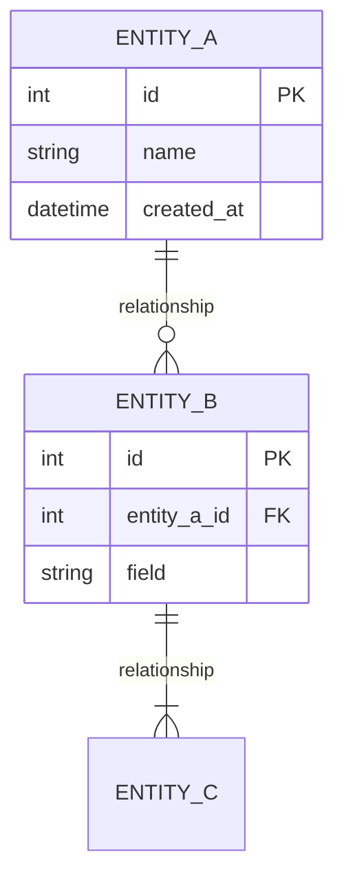

# Bước 7: ERD (Entity Relationship Diagram)

## 🎯 Mục tiêu bước này

- Liệt kê **tất cả thực thể (entities) quan trọng** trong domain
- Xác định **thuộc tính (attributes)** của mỗi thực thể
- Xác định **quan hệ (relationships)** giữa các thực thể
- Vẽ **ERD diagram** chi tiết bằng mermaid

---

## 📝 Các công việc cần làm

### 1. Liệt kê danh sách thực thể

Tạo bảng liệt kê TẤT CẢ thực thể:

| STT | Tên thực thể | Mô tả | Thuộc tính chính | Quan hệ |
|-----|--------------|-------|------------------|---------|
| 1 | [Entity 1] | [Mô tả ngắn gọn] | • id (PK)<br>• field1<br>• field2<br>• field3 | → [Entity 2] (FK)<br>→ [Entity 3] (FK) |

**Yêu cầu:**
- Liệt kê **15-30 thực thể** (tùy độ phức tạp domain)
- Mỗi thực thể liệt kê **3-5 thuộc tính quan trọng nhất**
- Ghi rõ **Primary Key (PK)** và **Foreign Key (FK)**
- Mô tả ngắn gọn **mối quan hệ** với thực thể khác

---

### 2. Vẽ ERD Diagram

Sử dụng **mermaid erDiagram** để vẽ ERD chi tiết.

#### Cú pháp mermaid ERD:



#### Ký hiệu quan hệ:

- `||--o{` : One-to-Many (một-nhiều)
- `||--||` : One-to-One (một-một)
- `}o--o{` : Many-to-Many (nhiều-nhiều)

**Yêu cầu:**
- Vẽ **TẤT CẢ thực thể** trong danh sách
- Hiển thị **các trường quan trọng** (không cần hiển thị tất cả)
- Thể hiện **tất cả quan hệ** chính

---

### 3. Giải thích các quan hệ quan trọng

Với MỖI quan hệ quan trọng, mô tả chi tiết:

#### Quan hệ X: [Entity A] - [Entity B]

**Loại quan hệ:** One-to-Many / Many-to-Many / One-to-One

**Mô tả:**
_Giải thích ý nghĩa nghiệp vụ của quan hệ này_

**Business Rule:**
_Quy tắc nghiệp vụ liên quan (constraints, validation)_

**Ví dụ:**
_Ví dụ cụ thể_

---

## 📊 Ví dụ mẫu (E-commerce)

### 1. Danh sách thực thể

| STT | Tên thực thể | Mô tả | Thuộc tính chính | Quan hệ |
|-----|--------------|-------|------------------|---------|
| 1 | **User** | Tài khoản người dùng (khách hàng, admin) | • id (PK)<br>• email (unique)<br>• password_hash<br>• role (enum)<br>• created_at | → UserAddress (1:N)<br>→ Order (1:N)<br>→ Cart (1:1)<br>→ Review (1:N) |
| 2 | **UserAddress** | Địa chỉ giao hàng của user | • id (PK)<br>• user_id (FK)<br>• recipient_name<br>• phone<br>• address_line<br>• city_id (FK)<br>• district_id (FK)<br>• is_default | ← User (N:1)<br>→ City (N:1)<br>→ District (N:1) |
| 3 | **City** | Thành phố/Tỉnh | • id (PK)<br>• name<br>• code | ← UserAddress (1:N)<br>← ShippingRule (1:N) |
| 4 | **District** | Quận/Huyện | • id (PK)<br>• city_id (FK)<br>• name<br>• code | ← UserAddress (1:N)<br>→ City (N:1) |
| 5 | **Product** | Sản phẩm | • id (PK)<br>• name<br>• sku (unique)<br>• price<br>• stock_quantity<br>• category_id (FK)<br>• brand_id (FK)<br>• status (enum) | → Category (N:1)<br>→ Brand (N:1)<br>→ CartItem (1:N)<br>→ OrderItem (1:N)<br>→ ProductImage (1:N)<br>→ Review (1:N) |
| 6 | **Category** | Danh mục sản phẩm | • id (PK)<br>• name<br>• parent_id (FK, self-ref)<br>• level | ← Product (1:N)<br>← Category (1:N, parent-child) |
| 7 | **Brand** | Thương hiệu | • id (PK)<br>• name<br>• logo_url | ← Product (1:N) |
| 8 | **ProductImage** | Hình ảnh sản phẩm | • id (PK)<br>• product_id (FK)<br>• image_url<br>• is_primary<br>• sort_order | ← Product (N:1) |
| 9 | **Cart** | Giỏ hàng | • id (PK)<br>• user_id (FK, unique)<br>• created_at<br>• updated_at | ← User (1:1)<br>→ CartItem (1:N) |
| 10 | **CartItem** | Sản phẩm trong giỏ hàng | • id (PK)<br>• cart_id (FK)<br>• product_id (FK)<br>• quantity<br>• price_at_add | ← Cart (N:1)<br>→ Product (N:1) |
| 11 | **Order** | Đơn hàng | • id (PK)<br>• user_id (FK)<br>• order_number (unique)<br>• status (enum)<br>• subtotal<br>• shipping_fee<br>• discount<br>• tax<br>• total<br>• payment_id (FK)<br>• promo_code_id (FK)<br>• created_at | ← User (N:1)<br>→ OrderItem (1:N)<br>→ ShippingAddress (1:1)<br>→ Payment (1:1)<br>→ PromoCode (N:1)<br>→ Shipment (1:1)<br>→ Return (1:1, optional) |
| 12 | **OrderItem** | Sản phẩm trong đơn hàng | • id (PK)<br>• order_id (FK)<br>• product_id (FK)<br>• quantity<br>• unit_price<br>• subtotal | ← Order (N:1)<br>→ Product (N:1) |
| 13 | **ShippingAddress** | Địa chỉ giao hàng (snapshot cho order) | • id (PK)<br>• order_id (FK, unique)<br>• recipient_name<br>• phone<br>• address_line<br>• city_name<br>• district_name | ← Order (1:1) |
| 14 | **Payment** | Giao dịch thanh toán | • id (PK)<br>• order_id (FK, unique)<br>• method (enum: COD/Card/Wallet)<br>• status (enum: Pending/Success/Failed)<br>• transaction_id<br>• amount<br>• created_at<br>• confirmed_at | ← Order (1:1) |
| 15 | **PromoCode** | Mã khuyến mãi | • id (PK)<br>• code (unique)<br>• type (enum: percentage/fixed/free_shipping)<br>• value<br>• min_order_value<br>• start_date<br>• end_date<br>• usage_limit<br>• usage_count | ← Order (1:N)<br>→ PromoUsage (1:N) |
| 16 | **PromoUsage** | Lịch sử sử dụng promo | • id (PK)<br>• promo_code_id (FK)<br>• user_id (FK)<br>• order_id (FK)<br>• used_at | ← PromoCode (N:1)<br>← User (N:1)<br>← Order (N:1) |
| 17 | **Shipment** | Vận chuyển | • id (PK)<br>• order_id (FK, unique)<br>• carrier (enum: GHN/GHTK/ViettelPost)<br>• tracking_number<br>• status (enum)<br>• picked_up_at<br>• in_transit_at<br>• delivered_at<br>• pod_image_url | ← Order (1:1)<br>→ ShipmentTracking (1:N) |
| 18 | **ShipmentTracking** | Lịch sử tracking | • id (PK)<br>• shipment_id (FK)<br>• status<br>• location<br>• timestamp<br>• note | ← Shipment (N:1) |
| 19 | **Return** | Trả hàng | • id (PK)<br>• order_id (FK, unique)<br>• reason (enum)<br>• status (enum: Requested/Approved/Rejected/Completed)<br>• requested_at<br>• approved_at<br>• completed_at | ← Order (1:1)<br>→ ReturnItem (1:N)<br>→ Refund (1:1) |
| 20 | **ReturnItem** | Sản phẩm trả hàng | • id (PK)<br>• return_id (FK)<br>• product_id (FK)<br>• quantity<br>• reason_detail | ← Return (N:1)<br>→ Product (N:1) |
| 21 | **Refund** | Hoàn tiền | • id (PK)<br>• return_id (FK, unique)<br>• order_id (FK)<br>• amount<br>• method (enum: Original/StoreCredit)<br>• status (enum: Pending/Completed)<br>• processed_at | ← Return (1:1)<br>← Order (N:1) |
| 22 | **Review** | Đánh giá sản phẩm | • id (PK)<br>• product_id (FK)<br>• user_id (FK)<br>• order_id (FK)<br>• rating (1-5)<br>• title<br>• content<br>• images[]<br>• is_verified_purchase<br>• created_at | ← Product (N:1)<br>← User (N:1)<br>← Order (N:1) |
| 23 | **Warehouse** | Kho hàng | • id (PK)<br>• name<br>• address<br>• city_id (FK)<br>• capacity | → City (N:1)<br>→ InventoryTransaction (1:N) |
| 24 | **InventoryTransaction** | Giao dịch tồn kho | • id (PK)<br>• product_id (FK)<br>• warehouse_id (FK)<br>• type (enum: IN/OUT/ADJUST)<br>• quantity (±)<br>• reference_type (enum: Order/Return/PO)<br>• reference_id<br>• timestamp | ← Product (N:1)<br>← Warehouse (N:1) |
| 25 | **ShippingRule** | Quy tắc phí ship | • id (PK)<br>• city_id (FK)<br>• base_fee<br>• distance_rate<br>• weight_rate<br>• free_shipping_threshold | ← City (N:1) |

---

### 2. ERD Diagram

```mermaid
erDiagram
    USER ||--o{ USER_ADDRESS : "has"
    USER ||--o{ ORDER : "places"
    USER ||--|| CART : "has"
    USER ||--o{ REVIEW : "writes"

    USER_ADDRESS }o--|| CITY : "in"
    USER_ADDRESS }o--|| DISTRICT : "in"

    DISTRICT }o--|| CITY : "belongs to"

    PRODUCT }o--|| CATEGORY : "in"
    PRODUCT }o--|| BRAND : "from"
    PRODUCT ||--o{ PRODUCT_IMAGE : "has"
    PRODUCT ||--o{ CART_ITEM : "in"
    PRODUCT ||--o{ ORDER_ITEM : "in"
    PRODUCT ||--o{ REVIEW : "has"
    PRODUCT ||--o{ RETURN_ITEM : "in"
    PRODUCT ||--o{ INVENTORY_TRANSACTION : "has"

    CATEGORY ||--o{ CATEGORY : "has subcategories"

    CART ||--|| USER : "belongs to"
    CART ||--o{ CART_ITEM : "contains"

    CART_ITEM }o--|| PRODUCT : "references"

    ORDER ||--|| USER : "placed by"
    ORDER ||--o{ ORDER_ITEM : "contains"
    ORDER ||--|| SHIPPING_ADDRESS : "ships to"
    ORDER ||--|| PAYMENT : "paid by"
    ORDER }o--o| PROMO_CODE : "uses"
    ORDER ||--o| SHIPMENT : "fulfilled by"
    ORDER ||--o| RETURN : "may have"

    ORDER_ITEM }o--|| PRODUCT : "references"

    PAYMENT ||--|| ORDER : "for"

    PROMO_CODE ||--o{ PROMO_USAGE : "tracked in"
    PROMO_CODE ||--o{ ORDER : "used in"

    PROMO_USAGE }o--|| USER : "by"
    PROMO_USAGE }o--|| ORDER : "for"

    SHIPMENT ||--|| ORDER : "for"
    SHIPMENT ||--o{ SHIPMENT_TRACKING : "has"

    RETURN ||--|| ORDER : "for"
    RETURN ||--o{ RETURN_ITEM : "contains"
    RETURN ||--|| REFUND : "results in"

    RETURN_ITEM }o--|| PRODUCT : "references"

    REFUND ||--|| ORDER : "for"

    REVIEW }o--|| PRODUCT : "for"
    REVIEW }o--|| USER : "by"
    REVIEW }o--o| ORDER : "from"

    WAREHOUSE }o--|| CITY : "in"
    WAREHOUSE ||--o{ INVENTORY_TRANSACTION : "has"

    INVENTORY_TRANSACTION }o--|| PRODUCT : "for"

    SHIPPING_RULE }o--|| CITY : "for"

    USER {
        int id PK
        string email UK
        string password_hash
        string role
        datetime created_at
    }

    USER_ADDRESS {
        int id PK
        int user_id FK
        string recipient_name
        string phone
        string address_line
        int city_id FK
        int district_id FK
        boolean is_default
    }

    CITY {
        int id PK
        string name
        string code UK
    }

    DISTRICT {
        int id PK
        int city_id FK
        string name
        string code
    }

    PRODUCT {
        int id PK
        string name
        string sku UK
        decimal price
        int stock_quantity
        int category_id FK
        int brand_id FK
        string status
        datetime created_at
    }

    CATEGORY {
        int id PK
        string name
        int parent_id FK
        int level
    }

    BRAND {
        int id PK
        string name
        string logo_url
    }

    PRODUCT_IMAGE {
        int id PK
        int product_id FK
        string image_url
        boolean is_primary
        int sort_order
    }

    CART {
        int id PK
        int user_id FK UK
        datetime created_at
        datetime updated_at
    }

    CART_ITEM {
        int id PK
        int cart_id FK
        int product_id FK
        int quantity
        decimal price_at_add
    }

    ORDER {
        int id PK
        int user_id FK
        string order_number UK
        string status
        decimal subtotal
        decimal shipping_fee
        decimal discount
        decimal tax
        decimal total
        int payment_id FK
        int promo_code_id FK
        datetime created_at
    }

    ORDER_ITEM {
        int id PK
        int order_id FK
        int product_id FK
        int quantity
        decimal unit_price
        decimal subtotal
    }

    SHIPPING_ADDRESS {
        int id PK
        int order_id FK UK
        string recipient_name
        string phone
        string address_line
        string city_name
        string district_name
    }

    PAYMENT {
        int id PK
        int order_id FK UK
        string method
        string status
        string transaction_id
        decimal amount
        datetime created_at
        datetime confirmed_at
    }

    PROMO_CODE {
        int id PK
        string code UK
        string type
        decimal value
        decimal min_order_value
        date start_date
        date end_date
        int usage_limit
        int usage_count
    }

    PROMO_USAGE {
        int id PK
        int promo_code_id FK
        int user_id FK
        int order_id FK
        datetime used_at
    }

    SHIPMENT {
        int id PK
        int order_id FK UK
        string carrier
        string tracking_number
        string status
        datetime picked_up_at
        datetime in_transit_at
        datetime delivered_at
        string pod_image_url
    }

    SHIPMENT_TRACKING {
        int id PK
        int shipment_id FK
        string status
        string location
        datetime timestamp
        string note
    }

    RETURN {
        int id PK
        int order_id FK UK
        string reason
        string status
        datetime requested_at
        datetime approved_at
        datetime completed_at
    }

    RETURN_ITEM {
        int id PK
        int return_id FK
        int product_id FK
        int quantity
        string reason_detail
    }

    REFUND {
        int id PK
        int return_id FK UK
        int order_id FK
        decimal amount
        string method
        string status
        datetime processed_at
    }

    REVIEW {
        int id PK
        int product_id FK
        int user_id FK
        int order_id FK
        int rating
        string title
        text content
        json images
        boolean is_verified_purchase
        datetime created_at
    }

    WAREHOUSE {
        int id PK
        string name
        string address
        int city_id FK
        int capacity
    }

    INVENTORY_TRANSACTION {
        int id PK
        int product_id FK
        int warehouse_id FK
        string type
        int quantity
        string reference_type
        int reference_id
        datetime timestamp
    }

    SHIPPING_RULE {
        int id PK
        int city_id FK
        decimal base_fee
        decimal distance_rate
        decimal weight_rate
        decimal free_shipping_threshold
    }
```

---

### 3. Giải thích các quan hệ quan trọng

#### Quan hệ 1: User - Order

**Loại quan hệ:** One-to-Many (Một khách hàng có thể có nhiều đơn hàng)

**Mô tả:**
Một User có thể tạo nhiều Order theo thời gian. Mỗi Order thuộc về duy nhất một User (không có đơn hàng chung giữa nhiều user).

**Business Rule:**
- User phải đăng ký tài khoản trước khi đặt hàng (hoặc guest checkout → tự động tạo user)
- User có thể xem lịch sử tất cả Order của mình
- Không được xóa User nếu còn Order đang pending (soft delete thay vì hard delete)

**Ví dụ:**
- User ID 123 (email: john@example.com) có:
  - Order #1001 (2024-01-01, status: Delivered)
  - Order #1002 (2024-01-15, status: Shipped)
  - Order #1003 (2024-01-20, status: Pending)

---

#### Quan hệ 2: Order - OrderItem

**Loại quan hệ:** One-to-Many (Một đơn hàng có nhiều sản phẩm)

**Mô tả:**
Mỗi Order chứa 1 hoặc nhiều OrderItem. Mỗi OrderItem đại diện cho 1 sản phẩm với số lượng cụ thể trong đơn hàng.

**Business Rule:**
- Order phải có ít nhất 1 OrderItem (không có đơn hàng rỗng)
- OrderItem lưu snapshot giá tại thời điểm mua (unit_price), không lấy giá real-time từ Product
- Nếu Order bị cancel → tất cả OrderItem cũng invalid
- Khi tính tổng Order:
  ```
  Order.total = SUM(OrderItem.subtotal) + shipping_fee - discount + tax
  OrderItem.subtotal = unit_price × quantity
  ```

**Ví dụ:**
- Order #1001:
  - OrderItem #1: Product "iPhone 15" × 1, unit_price = 20,000,000đ, subtotal = 20,000,000đ
  - OrderItem #2: Product "Ốp lưng" × 2, unit_price = 150,000đ, subtotal = 300,000đ
  - Order.subtotal = 20,300,000đ

---

#### Quan hệ 3: Product - Category

**Loại quan hệ:** Many-to-One (Nhiều sản phẩm thuộc về một danh mục)

**Mô tả:**
Mỗi Product thuộc về duy nhất một Category. Một Category có thể chứa nhiều Product.

**Business Rule:**
- Category có cấu trúc cây (parent-child) → Product thuộc leaf category (category cuối cùng, không có con)
- Ví dụ: Điện thoại → Smartphone → iPhone (Product thuộc "iPhone" category)
- Không được xóa Category nếu còn Product (phải move Product sang category khác trước)
- Product có thể có category_id = NULL (uncategorized) → cần admin phân loại

**Ví dụ:**
- Category Tree:
  ```
  Electronics (level 0)
  └── Smartphones (level 1)
      ├── iPhone (level 2)
      └── Samsung (level 2)
  ```
- Product "iPhone 15 Pro" → category_id = "iPhone" (level 2)

---

#### Quan hệ 4: Order - Payment

**Loại quan hệ:** One-to-One (Một đơn hàng có duy nhất một giao dịch thanh toán)

**Mô tả:**
Mỗi Order có duy nhất một Payment record, tracking thông tin thanh toán (method, status, transaction_id).

**Business Rule:**
- Payment được tạo cùng lúc với Order
- Nếu payment_method = COD → Payment.status = "Pending" (chờ thu tiền khi giao hàng)
- Nếu payment_method = Online → Phải confirm payment trước khi Order status chuyển sang "Confirmed"
- Payment.amount phải bằng Order.total
- Nếu Payment.status = "Failed" → Order không được tạo (hoặc auto cancel)

**Ví dụ:**
- Order #1001:
  - Payment #5001:
    - method = "CREDIT_CARD"
    - status = "SUCCESS"
    - transaction_id = "txn_abc123" (từ payment gateway)
    - amount = 20,300,000đ
    - confirmed_at = 2024-01-01 14:30:00

---

#### Quan hệ 5: Product - Inventory Transaction

**Loại quan hệ:** One-to-Many (Một sản phẩm có nhiều giao dịch tồn kho)

**Mô tả:**
Mỗi lần tồn kho thay đổi (nhập/xuất/điều chỉnh) tạo 1 InventoryTransaction để audit trail.

**Business Rule:**
- Khi Order được tạo → InventoryTransaction (type="OUT", quantity=-2, reference_type="Order", reference_id=order_id)
- Khi Return được hoàn tất → InventoryTransaction (type="IN", quantity=+1, reference_type="Return")
- Khi nhập hàng từ supplier → InventoryTransaction (type="IN", quantity=+100, reference_type="PO")
- Product.stock_quantity = SUM(InventoryTransaction.quantity) (cần tính lại nếu mất sync)

**Ví dụ:**
- Product "iPhone 15" (id=101):
  - Transaction #1: type="IN", quantity=+100, reference_type="PO", reference_id=501 (nhập 100 máy)
  - Transaction #2: type="OUT", quantity=-1, reference_type="Order", reference_id=1001 (bán 1 máy)
  - Transaction #3: type="OUT", quantity=-2, reference_type="Order", reference_id=1002 (bán 2 máy)
  - **Current stock = 100 - 1 - 2 = 97**

---

#### Quan hệ 6: Order - Return - Refund

**Loại quan hệ:** One-to-One chain (Order → Return → Refund)

**Mô tả:**
- Order có thể có 0 hoặc 1 Return (không phải tất cả order đều bị trả hàng)
- Nếu có Return → Return có duy nhất 1 Refund (sau khi approve)

**Business Rule:**
- Chỉ có thể tạo Return nếu Order.status = "Delivered"
- Return.requested_at phải trong vòng 7 ngày kể từ Order.delivered_at (return window)
- Khi Return được approve → tạo Refund
- Refund.amount có thể < Order.total (nếu chỉ trả một phần sản phẩm, hoặc trừ phí ship)
- Sau khi Refund.status = "Completed" → không thể thay đổi

**Ví dụ:**
- Order #1001 (total = 20,300,000đ, delivered_at = 2024-01-05):
  - Return #2001 (requested_at = 2024-01-07, reason = "Defective product", status = "Approved")
    - ReturnItem: Product "iPhone 15" × 1
  - Refund #3001:
    - amount = 20,000,000đ (trừ 300k phí ship không hoàn)
    - method = "Original" (hoàn về thẻ credit đã dùng)
    - status = "Completed"
    - processed_at = 2024-01-08

---

## 🤖 AI và Data Model

### AI sử dụng dữ liệu từ các thực thể:

**User Behavior Analysis:**
- `User` + `Order` + `OrderItem` → Phân tích lịch sử mua hàng, dự đoán CLV (Customer Lifetime Value)
- `User` + `Cart` + `CartItem` → Phát hiện abandoned cart, gửi reminder

**Recommendation Engine:**
- `Product` + `OrderItem` + `Review` → Collaborative filtering (người mua A cũng mua B)
- `User` + `Order` + `Product` → Personalized recommendation

**Inventory Forecasting:**
- `Product` + `InventoryTransaction` + `Order` → Dự đoán nhu cầu, tối ưu stock levels

**Fraud Detection:**
- `User` + `Order` + `Payment` + `UserAddress` → Phát hiện đơn hàng gian lận (IP, velocity, shipping address)

**Dynamic Pricing:**
- `Product` + `Order` + `Cart` (conversion rate) → Điều chỉnh giá theo nhu cầu

**Sentiment Analysis:**
- `Review` → Phân tích sentiment (positive/negative), extract insights

---

## ✅ Checklist hoàn thành

- [x] Đã liệt kê 15-30 thực thể với thuộc tính và quan hệ
- [x] Đã vẽ ERD diagram chi tiết bằng mermaid
- [x] Đã giải thích 5-8 quan hệ quan trọng nhất
- [x] Đã mô tả cách AI sử dụng data model
- [x] Đã cập nhật vào file .md
- [x] User xác nhận tiếp tục Bước 8

---

## 🔗 Bước tiếp theo

→ **[Bước 8: Phân tích đối thủ & thị trường](stage-8-competitors.md)**