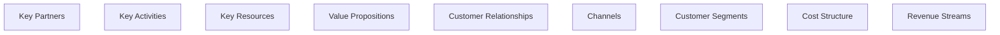
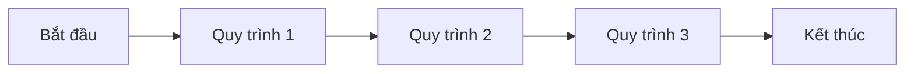
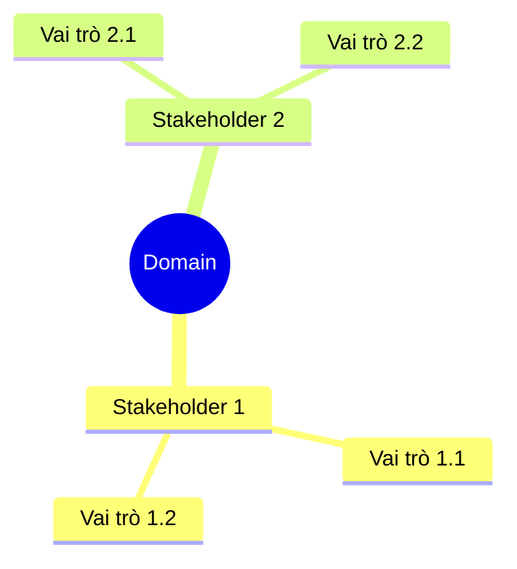
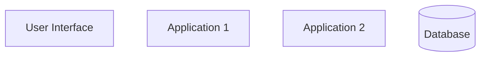
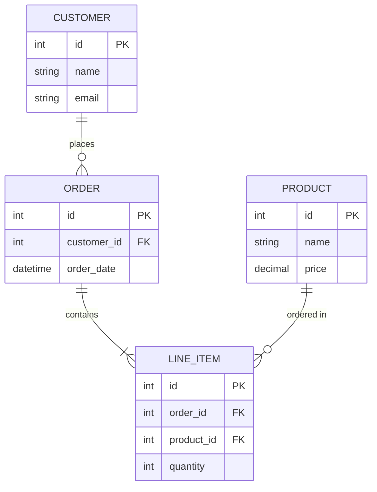

# Phân Tích Domain: {{DOMAIN_NAME}}

**Ngày tạo:** {{DATE}}
**Người phân tích:** {{ANALYST_NAME}}
**Trạng thái:** {{STATUS}}

---

## 📋 Mục lục

- [0. Tổng quan Domain](#0-tổng-quan-domain)
- [1. Business Model Canvas](#1-business-model-canvas)
- [2. Lean Canvas](#2-lean-canvas)
- [3. Quy trình End-to-End](#3-quy-trình-end-to-end)
- [4. Stakeholder & Vai trò](#4-stakeholder--vai-trò)
- [5. Phân tích sâu quy trình](#5-phân-tích-sâu-quy-trình)
- [6. Ứng dụng & Chức năng](#6-ứng-dụng--chức-năng)
- [7. ERD (Entity Relationship Diagram)](#7-erd-entity-relationship-diagram)
- [8. Phân tích đối thủ & thị trường](#8-phân-tích-đối-thủ--thị-trường)

---

## 0. Tổng quan Domain

### 0.1. Giới thiệu tổng quan

_[Nội dung sẽ được cập nhật ở Bước 0]_

### 0.2. Bảng thuật ngữ quan trọng

| STT | Thuật ngữ | Tiếng Anh | Định nghĩa | Ví dụ |
|-----|-----------|-----------|------------|-------|
| 1   | | | | |

### 0.3. Danh sách phần mềm quản lý vận hành

| Tên viết tắt | Tên đầy đủ | Mục đích | Các tính năng chính |
|--------------|------------|----------|---------------------|
| | | | |

### 0.4. Tình trạng hiện tại

- ⬜ Đang vận hành thủ công
- ⬜ Đã có phần mềm hỗ trợ một phần
- ⬜ Đã có hệ thống phần mềm đầy đủ

---

## 1. Business Model Canvas

### 1.1. Tổng quan 9 yếu tố



### 1.2. Key Activities (Hoạt động chính)

#### Hoạt động 1: [Tên hoạt động]

**Ai tham gia:**
_[Danh sách vai trò]_

**Các bước thực hiện:**

| Ai | Làm gì | Mục đích/Đầu ra | Phần mềm liên quan | Tính năng cần có |
|----|--------|-----------------|--------------------|--------------------|
| | | | | |

**Kết quả mong đợi:**
_[Mô tả]_

**Nhận xét/Cải tiến:**
_[Ghi chú]_

### 1.3. Key Partners (Đối tác chính)

#### Đối tác 1: [Tên đối tác]

**Mục đích hợp tác:**
_[Mô tả]_

**Quy trình phối hợp:**

| Ai | Làm gì | Đầu ra | Tần suất | Kênh tương tác |
|----|--------|--------|----------|----------------|
| | | | | |

**Tin học hóa:**
- Chức năng cần có:
- Tích hợp cần thiết (API, EDI, Portal):
- Dữ liệu trao đổi:
- Yêu cầu bảo mật:

### 1.4. Cost Structure (Cấu trúc chi phí)

#### Chi phí 1: [Tên chi phí]

**Công thức tính:**

```
[Tên chi phí] = [Công thức chi tiết]

Trong đó:
- [Tham số 1]: [Mô tả, kiểu dữ liệu, đơn vị, nguồn dữ liệu, phạm vi giá trị]
- [Tham số 2]: ...
```

**Ví dụ tính toán:**
_[Ví dụ cụ thể với số liệu]_

**Liên kết phần mềm:**
- Module kế toán/ERP:
- Mã GL (General Ledger):
- Thời điểm ghi nhận:
- Loại chi phí:
- Quy tắc phân bổ:

### 1.5. Revenue Streams (Nguồn doanh thu)

#### Doanh thu 1: [Tên nguồn doanh thu]

**Công thức tính:**

```
[Tên doanh thu] = [Công thức chi tiết]

Trong đó:
- [Tham số 1]: [Mô tả, kiểu dữ liệu, đơn vị, nguồn dữ liệu, phạm vi giá trị]
- [Tham số 2]: ...
```

**Ví dụ tính toán:**
_[Ví dụ cụ thể với số liệu]_

**Quy trình ghi nhận:**
- Điều kiện ghi nhận:
- Phương thức thanh toán:
- Thuế, chiết khấu, hoàn tiền:

**Tính năng phần mềm:**
- Cấu hình công thức:
- Quản lý hợp đồng doanh thu:
- Đối soát tự động:
- Báo cáo lợi nhuận:

### 1.6. Các yếu tố khác

#### Value Propositions (Giá trị khách hàng)

_[Nội dung]_

#### Customer Segments (Phân khúc khách hàng)

_[Nội dung]_

#### Channels (Kênh phân phối)

_[Nội dung]_

#### Customer Relationships (Quan hệ khách hàng)

_[Nội dung]_

#### Key Resources (Nguồn lực chính)

_[Nội dung]_

### 1.7. AI hỗ trợ Business Model

_[Mô tả cách AI thay đổi business model, hỗ trợ các hoạt động]_

---

## 2. Lean Canvas

| Mục | Nội dung | Chức năng phần mềm cần có |
|-----|----------|---------------------------|
| **Problem** (Vấn đề) | | |
| **Solution** (Giải pháp) | | |
| **Key Metrics** (Chỉ số quan trọng) | | |
| **Unique Value Proposition** (Giá trị độc nhất) | | |
| **Unfair Advantage** (Lợi thế cạnh tranh) | | |
| **Channels** (Kênh) | | |
| **Customer Segments** (Phân khúc KH) | | |
| **Cost Structure** (Cấu trúc chi phí) | | |
| **Revenue Streams** (Nguồn doanh thu) | | |

### 2.1. AI hỗ trợ Lean Canvas

_[Mô tả]_

---

## 3. Quy trình End-to-End

### 3.1. Sơ đồ quy trình tổng quan



### 3.2. Quy trình cốt lõi

#### Quy trình 1: [Tên quy trình]

**Mô tả:**
_[Mô tả ngắn gọn]_

**Thực thể quản lý:**

| Thực thể | Thuộc tính cơ bản | Mô tả |
|----------|-------------------|-------|
| | | |

**Chức năng phần mềm cần có:**

- [ ] Chức năng 1
- [ ] Chức năng 2

### 3.3. AI hỗ trợ quy trình

_[Mô tả]_

---

## 4. Stakeholder & Vai trò

### 4.1. Sơ đồ Stakeholder



### 4.2. Bảng chi tiết Stakeholder

| Stakeholder | Vai trò | Công việc chính | Phần mềm hỗ trợ | Chức năng cần có |
|-------------|---------|-----------------|-----------------|------------------|
| | | | | |

### 4.3. AI hỗ trợ Stakeholder

_[Mô tả]_

---

## 5. Phân tích sâu quy trình

### 5.1. Quy trình được chọn: [Tên quy trình]

**Lý do chọn:**
_[Giải thích]_

### 5.2. Các bước chi tiết

#### Bước 1: [Tên bước]

**Mô tả:**
_[Mô tả chi tiết]_

**Input:**
- Input 1: [Loại dữ liệu, nguồn, định dạng]
- Input 2: ...

**Output:**
- Output 1: [Loại dữ liệu, đích đến, định dạng]
- Output 2: ...

**Quy tắc nghiệp vụ:**
1. Rule 1
2. Rule 2

**Ngoại lệ:**
- Exception 1: [Mô tả, cách xử lý]
- Exception 2: ...

**Công thức nghiệp vụ:**

```
[Công thức] = [Chi tiết]

Trong đó:
- Tham số 1: ...
```

**Cơ hội cải tiến:**
_[Gợi ý]_

**Quy định cần tuân thủ:**
_[Compliance requirements]_

**Mapping phần mềm:**

| Bước nghiệp vụ | Chức năng phần mềm | Module | Màn hình/API | Dữ liệu lưu trữ |
|----------------|--------------------|---------|--------------|-----------------|
| | | | | |

### 5.3. AI hỗ trợ quy trình chi tiết

_[Mô tả]_

---

## 6. Ứng dụng & Chức năng

### 6.1. Kiến trúc hệ thống tổng quan



### 6.2. Danh sách ứng dụng & module

#### Ứng dụng 1: [Tên ứng dụng]

**Mục đích:**
_[Mô tả]_

**Module chính:**

| Module | Mô tả | Chức năng cốt lõi | Ý nghĩa |
|--------|-------|-------------------|---------|
| | | | |

**Giao diện chính:**

| Màn hình | Loại | Người dùng | Chức năng | Ý nghĩa |
|----------|------|------------|-----------|---------|
| | | | | |

### 6.3. Bảng tổng hợp chức năng

| STT | Module | Chức năng | Mô tả chi tiết | Ý nghĩa | Độ ưu tiên |
|-----|--------|-----------|----------------|---------|------------|
| 1 | | | | | |

### 6.4. AI tích hợp vào ứng dụng

_[Mô tả các tính năng AI]_

---

## 7. ERD (Entity Relationship Diagram)

### 7.1. Danh sách thực thể quan trọng

| STT | Tên thực thể | Mô tả | Thuộc tính chính | Quan hệ |
|-----|--------------|-------|------------------|---------|
| 1 | | | | |

### 7.2. Sơ đồ ERD



### 7.3. Giải thích quan hệ

#### Quan hệ 1: [Entity A] - [Entity B]

**Loại quan hệ:** One-to-Many / Many-to-Many / One-to-One

**Mô tả:**
_[Giải thích]_

**Business Rule:**
_[Quy tắc nghiệp vụ]_

### 7.4. AI và Data Model

_[Mô tả cách AI sử dụng dữ liệu]_

---

## 8. Phân tích đối thủ & thị trường

### 8.1. Danh sách đối thủ

| STT | Tên sản phẩm/Công ty | Quốc gia | Phân khúc | Website |
|-----|----------------------|----------|-----------|---------|
| 1 | | | | |

### 8.2. So sánh tính năng

| Tính năng | Đối thủ 1 | Đối thủ 2 | Đối thủ 3 | Nhận xét |
|-----------|-----------|-----------|-----------|----------|
| | ✅/❌ | ✅/❌ | ✅/❌ | |

### 8.3. Phân tích đối thủ Việt Nam

#### Đối thủ 1: [Tên]

**Tính năng nổi bật:**
- Tính năng 1
- Tính năng 2

**Điểm mạnh:**
_[Phân tích]_

**Điểm yếu:**
_[Phân tích]_

**Chiến lược giá:**
_[Mô tả]_

### 8.4. Xu hướng công nghệ

#### Xu hướng 1: [Tên xu hướng]

**Mô tả:**
_[Chi tiết]_

**Ứng dụng trong domain:**
_[Cách áp dụng]_

**Ví dụ thực tế:**
_[Case study]_

### 8.5. Công nghệ AI trong domain

**AI đang được áp dụng:**
- Ứng dụng AI 1
- Ứng dụng AI 2

**Xu hướng AI tương lai:**
_[Dự đoán]_

**Cơ hội cho sản phẩm mới:**
_[Phân tích]_

---

## 📝 Ghi chú & Tham khảo

### Nguồn tham khảo

1. [Nguồn 1]
2. [Nguồn 2]

### Câu hỏi cần làm rõ

- [ ] Câu hỏi 1
- [ ] Câu hỏi 2

### Các bước tiếp theo

- [ ] Hành động 1
- [ ] Hành động 2

---

**© {{YEAR}} - Tài liệu phân tích domain được tạo bởi BA Team**